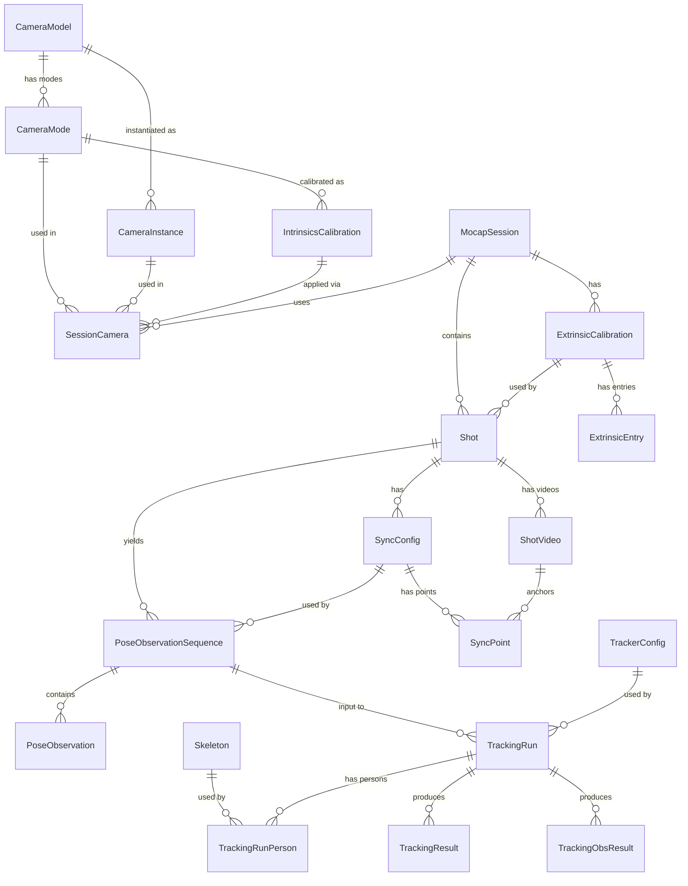

# Data model

Posetrak uses two SQLite databases.  All data is stored as relational rows and packed binary BLOBs — no HDF5 or external binary files are required.

---

## Entity–relationship overview

---

## Primary key conventions

| Pattern | Entities | Format |
|---|---|---|
| UUIDv4 | all auto-generated PKs | Generated by the application at INSERT time |
| SHA-256 hex | `Skeleton` only | 64-character lowercase hex of `yaml_content` |

UUIDs are generated client-side, which simplifies import tooling and offline workflows.  `Skeleton` uses content-addressing so that identical YAML always maps to the same row and rows are immutable.

---

## Key design decisions

### Camera modes decouple hardware from calibration

Intrinsics are tied to `CameraMode` (resolution + codec), not to `CameraInstance`.  The same physical camera can run in different modes across sessions; each combination gets its own calibration without duplicating hardware metadata.

### Extrinsics are per-shot, not per-session

A session usually shares one extrinsic calibration, but a mid-session re-calibration (e.g. after a camera is knocked) can be captured by assigning a different calibration to specific shots.

### Sync configs are per-shot

Multiple pose observation sequences in the same shot share one sync config.  This matches reality: sync alignment is done once per recording.

### Frame index namespacing

Two distinct integer frame counters appear in the model:

- **`video_frame`** — absolute index into the original video file.  `ShotVideo.first_video_frame` and `SyncPoint.video_frame` are in the same coordinate system (frame 0 is the first frame of the physical file).  Never store frame numbers relative to `first_video_frame`.
- **`tracker_step`** — UKF predict/update cycle index, starting at 0 for each tracking run.

`timestamp_s` is the bridge between the two domains.

### Skeletons are content-addressed and immutable

`Skeleton.id` is the SHA-256 hash of `yaml_content`.  The content of an existing row can never change.  `parent_id` chains versions: scaling or editing a skeleton inserts a new row with `parent_id` pointing to its predecessor.

### TrackerConfigs are immutable with explicit versioning

`TrackerConfig.id` is a UUID assigned at creation; rows are never updated.  `parent_id` links the version chain.  `TrackingRun` records the exact config UUID, so past runs always reference the exact parameters that produced them.

### Observation sequences are the atomic tracking input

A single tracker run consumes exactly one `PoseObservationSequence`.  All relationships required to reproduce a run are reachable from `TrackingRun`: observations → sequence → shot → extrinsics → cameras (with intrinsics), sync config, per-person skeletons, and tracker config.

### `TrackingObsResult` uses a packed float32 blob

Per-observation diagnostics (reprojection coordinates, Mahalanobis distance, outlier flag) are stored as a packed `float32` array rather than individual rows.  At 120 fps × 600 s × 6 cameras × 30 markers, row-per-observation would produce ~13 M rows per run; the blob approach gives one row per `(run_id, person_id, tracker_step)` instead.

The canonical camera and marker ordering that indexes into the blob is stored once per run in `TrackingRun.active_camera_ids` and `TrackingRun.marker_names` (JSON arrays).

### File paths

`ShotVideo.file_path` may be absolute or relative.  Relative paths are resolved against the `project_root` setting in the registry DB.  Tools that write paths should prefer relative paths when the file is under the project root; tools that read paths must resolve against `project_root` when the path is not absolute.

---

## BLOB formats

### `PoseObservation.kp_blob` / `detection_keypoints.kp_blob`

`float32[N, 3]` where N is the number of keypoints for the pose model used in the detection run.  Columns: `[x_px, y_px, confidence]`.  Coordinates are in full-frame distorted pixel space (K_original).  See `blob_codec.hpp` for the C++ deserialiser.

### `ExtrinsicEntry.R`, `ExtrinsicEntry.t`

`float64[3,3]` rotation matrix and `float64[3]` translation vector, both C-contiguous (row-major).

### `TrackingResult.state`, `TrackingResult.cov_diag`

See [state-vector-format.md](../reference/state-vector-format.md) for the full layout.

### `TrackingObsResult.obs_blob`

`float32[n_cameras, n_markers, 4]` where the last axis is `[x_px, y_px, mahalanobis_distance, is_inlier]`.  Coordinates are in undistorted pixel space (K_new).  Camera and marker ordering from `TrackingRun.active_camera_ids` and `.marker_names`.

---

## Schema versioning

Both databases use `PRAGMA user_version` as a monotonic migration counter.  `open_session()` in `db.py` applies outstanding migrations automatically on every open.  The C++ `SessionReader` does not check the version — it reads whatever tables are present, so new optional tables (like `pose_observation_edits`) must be handled gracefully.

Current versions (as of 2026-06):
- Registry DB: `REGISTRY_SCHEMA_VERSION` in `db.py`
- Session DB: version 20+ (see migration functions in `db.py`)
