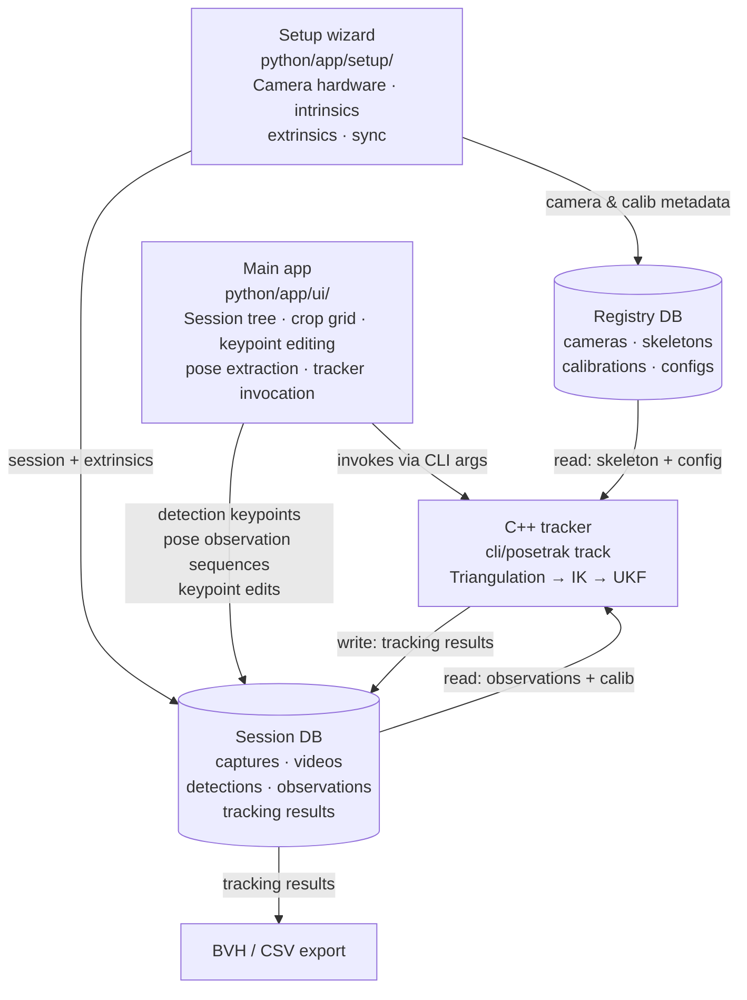

# Posetrak architecture overview

Posetrak is a multi-camera motion capture suite that estimates full-body 3-D skeletal pose from ordinary video.  The key architectural split is between the **C++ tracker** — a command-line binary — and the **Python Qt UI** that drives it.  They communicate via a shared SQLite database: the tracker reads observations and writes results; the Python apps manage everything else.  No network service is required.

## Key technology choices

| Component | Technology |
|---|---|
| Tracker | C++20, Eigen, Pinocchio (FK), fmt |
| GUI apps | Python, PySide6 (Qt 6) |
| Storage | SQLite (two files: registry + session) |
| Person detection | YOLOv11 + ByteTrack, or SAM2 segmentation |
| Pose estimation | RTMPose or VITpose++ |
| Build | Meson, wrap-based dependency management |

---

## System components



---

## User-facing data model

The data model maps directly to how a session is structured:

**Capture** — one continuous recording (all cameras on → off) plus its extrinsics calibration and sync solution.  A single timescale covers all cameras.

**Trial** — a named time window within a capture (one technique, one attempt).

**Detection run** — pose estimates for all persons visible in a trial, produced by running the detection pipeline on the capture videos.  Contains anonymous tracks (person identities not yet assigned).

**Person observation sequence** — the keypoints for one named person in one detection run.  Created by the stitching step where the user assigns anonymous tracks to named persons.  This is the direct input to the tracker.

**Tracking result** — the UKF-filtered skeleton state (joint angles, root pose, velocities) for one person over one trial, produced by the C++ tracker from one observation sequence.

---

## End-to-end data flow

Two detection pipelines are supported; both produce the same observation sequences:

### YOLO pipeline (single-pass)

```
Video files
    └── YOLOv11 + ByteTrack  →  person bboxes per frame
        RTMPose or VITpose++  →  keypoint blobs per bbox
        → detection_keypoints, person_detections, frame_cache_entries
        → [user stitches tracks to named persons]
        → pose_observation_sequences, pose_observations
```

### SAM2 pipeline (two-pass, with interactive adjustment)

```
Video files
    └── SAM2 video segmentation  →  person masks per frame
        [User reviews and corrects segmentations interactively]
        RTMPose or VITpose++  →  keypoints from segmented crops
        → detection_keypoints, …
        → [user stitches] → pose_observation_sequences
```

### Common downstream path

```
pose_observation_sequences
    ├── [Optional] User corrects keypoints (editing UI)
    │   → pose_observation_edits (overlay, applied at tracker load time)
    └── C++ tracker: DLT triangulation → IK init → UKF per frame
        → tracking_results, tracking_obs_results
        → CSV export + BVH export
```

---

## Two-database design

| Database | Default location | Contains |
|---|---|---|
| **Registry DB** | `~/.posetrak/registry.db` | Camera hardware definitions, intrinsics calibrations, skeleton YAML files, tracker configs |
| **Session DB** | one per recording session | All session-specific data: captures, videos, detections, observations, tracking results |

The session DB is **self-contained** — it mirrors the registry rows it needs at creation time, so a session can be moved to another machine without the registry.

Cross-database foreign keys are stored as TEXT IDs but cannot be enforced at the SQLite level.  The C++ `SessionReader` opens the session DB read-only; all writes go through Python.

---

## Session DB schema layers

**Layer 0 — session structure**
`mocap_sessions`, `captures` (alias: *shots*), `trials`, `capture_videos` (alias: *shot_videos*), `session_cameras`.  `trials` are named time windows within a capture; they are the parent of both detection runs and tracking runs.

**Layer 1 — calibration and sync**
`extrinsic_calibrations`, `extrinsic_entries`, `intrinsics_calibrations` (mirrored from registry), `sync_configs`, `sync_points`.  Extrinsics live at the capture level so a mid-session re-calibration can be captured.

**Layer 2 — detection pipeline (anonymous tracks)**
`detection_runs` (linked to a trial via `trial_id`), `detection_keypoints`, `person_detections`, `person_tracks`, `frame_cache_entries` (JPEG crop blobs), `detection_track_assignments`, `keypoint_obs_quality`.  `track_id` in this layer is the ByteTrack ID — it carries no person identity.

**Layer 3 — named person observations**
`pose_observation_sequences`, `sequence_persons`, `pose_observations`, `pose_observation_edits`.  Produced by `finalise_to_db()` after the user completes stitching.  This is the input to the tracker.

**Layer 4 — tracking results**
`tracking_runs` (`trial_id` FK links each run directly to its trial), `tracking_run_persons`, `tracking_results` (state vector + covariance diagonal + NIS per frame), `tracking_obs_results` (projected marker 2-D positions).  Written by the C++ tracker.

---

## Coordinate spaces

| Space | Units | Notes |
|---|---|---|
| Full-frame distorted (K_original) | pixels | Raw video frame; all detection keypoints are stored here |
| Full-frame undistorted (K_new) | pixels | C++ tracker's working space; `tracking_obs_results` are in this space |
| Crop display space | pixels | Widget pixels after letterbox scaling; `frame_cache_entries.src_x/y/w/h` give the inverse transform to K_original |
| Camera space | metres | `x_cam = R * x_world + t` |
| World space | metres | Common 3-D reference frame; camera positions stored as `−R^T t` |

Current detection pipeline stores distorted coordinates (`pixels_are_undistorted = 0`).  The C++ tracker calls `camera->undistort()` before computing FK / reprojection.

---

## Schema versioning

Both databases use `PRAGMA user_version` as a monotonic migration counter.  `open_session()` in Python applies outstanding migrations automatically.  The C++ `SessionReader` does not check the version — new optional tables must be handled gracefully.

Current session DB schema version: **25** (as of 2026-07).

---

## Further reading

- [C++ tracker architecture](cpp-tracker.md)
- [Python applications](python-apps.md)
- [Data model detail](data-model.md)
- [UKF algorithm](algorithms/ukf.md)
