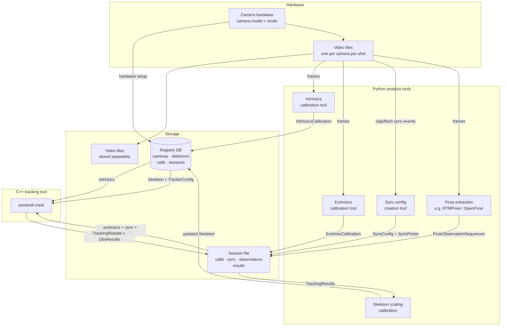

# Motion Capture Data Model and Storage Architecture

## 1. Entity–Relationship Model

The following diagram shows every first-class data entity and the relationships between them.
Cardinality notation: `||--o{` = one-to-many, `}o--o{` = many-to-many.

```mermaid
erDiagram

  CameraModel {
    string id PK
    string manufacturer
    string model_name
    string sensor_size
  }

  CameraMode {
    string id PK
    string camera_model_id FK
    int    width_px
    int    height_px
    float  nominal_fps
    string codec
    string notes
  }

  IntrinsicsCalibration {
    string id PK
    string camera_mode_id FK
    date   calibrated_at
    string calibration_tool
    string distortion_model
    float  fx
    float  fy
    float  cx
    float  cy
    blob   dist_coeffs
    float  rms_error
    string notes
  }

  CameraInstance {
    string id PK
    string camera_model_id FK
    string serial_number
    string label
  }

  MocapSession {
    string id PK
    date   recorded_at
    string location
    string notes
  }

  SessionCamera {
    string session_id FK
    string camera_instance_id FK
    string camera_mode_id FK
    string intrinsics_calibration_id FK
    string label
  }

  ExtrinsicCalibration {
    string id PK
    string session_id FK
    date   calibrated_at
    string method
    float  rms_error
  }

  ExtrinsicEntry {
    string extrinsic_calibration_id FK
    string camera_instance_id FK
    blob   R
    blob   t
  }

  Shot {
    string id PK
    string session_id FK
    string extrinsic_calibration_id FK
    int    shot_number
    string label
    string notes
  }

  ShotVideo {
    string id PK
    string shot_id FK
    string camera_instance_id FK
    string file_path
    int    first_video_frame
    int    last_video_frame
    float  actual_fps
  }

  SyncConfig {
    string id PK
    string shot_id FK
    string created_by
    string notes
  }

  SyncPoint {
    string sync_config_id FK
    string camera_instance_id FK
    string shot_video_id FK
    int    video_frame
    float  timestamp_s
  }

  PoseObservationSequence {
    string id PK
    string shot_id FK
    string sync_config_id FK
    float  time_start_s
    float  time_end_s
    string pose_model
    string notes
  }

  PoseObservation {
    string sequence_id FK
    string camera_instance_id FK
    int    video_frame
    float  timestamp_s
    int    person_id
    blob   kp_blob
  }

  Skeleton {
    string id PK
    string name
    string parent_id FK
    string person_label
    string source
    string yaml_content
    datetime created_at
    string notes
  }

  TrackerConfig {
    string   id PK
    string   name
    string   parent_id FK
    datetime created_at
    float    alpha
    float    beta
    float    kappa
    float    process_noise_std
    float    measurement_noise_std
    float    outlier_threshold
    float    tracker_fps
    int      ik_max_iterations
    float    ik_tolerance
    float    init_position_std
    float    init_orientation_std
    float    init_joint_std
    float    init_velocity_std
    int      min_cameras_for_init
    string   notes
  }

  TrackingRun {
    string   id PK
    string   observation_sequence_id FK
    string   tracker_config_id FK
    string   extrinsic_calibration_id FK
    string   sync_config_id FK
    datetime ran_at
    string   posetrak_version
    string   active_camera_ids
    string   marker_names
  }

  TrackingRunPerson {
    string run_id FK
    int    person_id
    string skeleton_id FK
  }

  TrackingResult {
    string  run_id FK
    int     person_id FK
    int     tracker_step
    bool    is_smoothed
    float   timestamp_s
    bool    tracking_lost
    int     n_inlier_observations
    float   cov_condition_number
    blob    state
    blob    cov_diag
  }

  TrackingObsResult {
    string run_id FK
    int    person_id FK
    int    tracker_step
    blob   obs_blob
  }

  CameraModel     ||--o{ CameraMode               : "has modes"
  CameraModel     ||--o{ CameraInstance            : "instantiated as"
  CameraMode      ||--o{ IntrinsicsCalibration     : "calibrated as"
  CameraMode      ||--o{ SessionCamera             : "used in"
  CameraInstance  ||--o{ SessionCamera             : "used in"
  IntrinsicsCalibration ||--o{ SessionCamera       : "applied via"
  MocapSession    ||--o{ SessionCamera             : "uses"
  MocapSession    ||--o{ ExtrinsicCalibration      : "has"
  MocapSession    ||--o{ Shot                      : "contains"
  ExtrinsicCalibration ||--o{ ExtrinsicEntry       : "has entries"
  ExtrinsicCalibration ||--o{ Shot                 : "used by"
  Shot            ||--o{ ShotVideo                 : "has videos"
  Shot            ||--o{ SyncConfig                : "has"
  Shot            ||--o{ PoseObservationSequence   : "yields"
  SyncConfig      ||--o{ SyncPoint                 : "has points"
  ShotVideo       ||--o{ SyncPoint                 : "anchors"
  SyncConfig      ||--o{ PoseObservationSequence   : "used by"
  PoseObservationSequence ||--o{ PoseObservation   : "contains"
  PoseObservationSequence ||--o{ TrackingRun       : "input to"
  Skeleton        ||--o{ Skeleton                  : "parent of"
  Skeleton        ||--o{ TrackingRunPerson         : "used by"
  TrackerConfig   ||--o{ TrackerConfig             : "parent of"
  TrackerConfig   ||--o{ TrackingRun               : "used by"
  TrackingRun     ||--o{ TrackingRunPerson         : "has persons"
  TrackingRun     ||--o{ TrackingResult            : "produces"
  TrackingRun     ||--o{ TrackingObsResult         : "produces"
  TrackingRunPerson ||--o{ TrackingResult          : "produces"
  TrackingRunPerson ||--o{ TrackingObsResult       : "produces"
```



---

## 2. Primary Keys and ID Formats

### ID formats

| Pattern | Used by | Format |
|---|---|---|
| **UUIDv4** | all auto-generated PKs | `"a1b2c3d4-e5f6-4890-abcd-ef1234567890"` — generated by the application at insert time, never by the DB |
| **SHA-256 hex** | `Skeleton.id` only | 64-character lowercase hex string derived from `yaml_content` |

Using UUIDs means IDs are globally unique across databases and can be generated
client-side before the INSERT, which simplifies import tooling and offline workflows.
The only exception is `Skeleton`, where the ID must be derived from content to guarantee
immutability and deduplication.

### Composite primary keys

All composite primary keys are listed explicitly here.

| Table | Primary Key |
|---|---|
| `CameraModel` | `id` |
| `CameraMode` | `id` |
| `IntrinsicsCalibration` | `id` |
| `CameraInstance` | `id` |
| `MocapSession` | `id` |
| `SessionCamera` | `(session_id, camera_instance_id)` |
| `ExtrinsicCalibration` | `id` |
| `ExtrinsicEntry` | `(extrinsic_calibration_id, camera_instance_id)` |
| `Shot` | `id` |
| `ShotVideo` | `id` |
| `SyncConfig` | `id` |
| `SyncPoint` | `(sync_config_id, camera_instance_id)` |
| `PoseObservationSequence` | `id` |
| `PoseObservation` | `(sequence_id, camera_instance_id, video_frame, person_id)` |
| `Skeleton` | `id` (SHA-256 of `yaml_content`) |
| `TrackerConfig` | `id` (UUID) |
| `TrackingRun` | `id` |
| `TrackingRunPerson` | `(run_id, person_id)` |
| `TrackingResult` | `(run_id, person_id, tracker_step, is_smoothed)` |
| `TrackingObsResult` | `(run_id, person_id, tracker_step)` |

---

## 3. Key Design Decisions Embedded in the Model

### Camera modes decouple hardware from calibration
Intrinsics are tied to `CameraMode` (resolution + codec), not to `CameraInstance`.  The same
physical camera (instance) can run in different modes across sessions; each combination gets
its own intrinsics calibration without duplicating hardware metadata.

### Intrinsics carry distortion model metadata
`distortion_model` (`"radtan"` / `"fisheye"` / `"none"`) makes the interpretation of
`dist_coeffs` unambiguous without reading code.  `calibration_tool` records the provenance
(e.g. `"opencv_charuco"`, `"kalibr"`).

### Extrinsics live at the shot level, not the session level
A session usually shares one extrinsic calibration, but re-calibration mid-session (e.g.
after a camera is accidentally moved) can be captured by assigning a different
`ExtrinsicCalibration` to specific shots.

### Sync configs are per-shot, not per-sequence
A shot has exactly one sync config; multiple pose observation sequences share it.  This
matches reality: the sync alignment is done once per recording, then different time windows
or person crops are extracted from the same sync baseline.

### Frame-index namespacing
Two distinct integer frame counters appear in the model and must not be confused:
- **`video_frame`** — **absolute** index into the original video file (`ShotVideo`,
  `SyncPoint`, `PoseObservation`).  `ShotVideo.first_video_frame` and `SyncPoint.video_frame`
  are in the same coordinate: frame 0 is the first frame of the physical file regardless
  of where the shot starts.  Do not store frame numbers relative to `ShotVideo.first_video_frame`;
  that would require context to interpret.
- **`tracker_step`** — UKF predict/update cycle index, starting at 0 for each tracking run
  (`TrackingResult`, `TrackingObsResult`)

`timestamp_s` is the bridge between the two domains.

### `SyncPoint` carries a direct FK to `ShotVideo`
A sync point is a marked frame in a specific camera's video file.  Carrying
`shot_video_id` directly on `SyncPoint` makes this relationship explicit and avoids a
three-table join (`SyncPoint → SyncConfig → Shot → ShotVideo`) when correlating sync
timestamps with video file metadata.

### File path convention
`ShotVideo.file_path` (and any other path column) may be **absolute** or **relative**.
- A path beginning with `/` (Linux/macOS) or a drive letter (Windows) is absolute.
- All other paths are relative to the **project root**, a per-registry setting stored in
  the `settings` table (`key = 'project_root'`).

Using relative paths makes session databases portable when the video archive is moved as
a unit.  Tools that write paths should prefer relative paths when the file is under the
project root; tools that read paths must resolve against the registry's `project_root`
when the path is not absolute.

### Pose blob extensibility for additional observation sources
`PoseObservation.kp_blob` currently stores keypoints from a single pose detector
(`pose_model`), with keypoint count and ordering implied by the model name.

To support additional observation points in future (e.g. visual fiducial markers or
manually labelled points alongside the pose keypoints), the seam is a per-sequence
keypoint manifest table:

```sql
-- Future: PoseSequenceKeypoints (not yet implemented)
CREATE TABLE pose_sequence_keypoints (
    sequence_id   TEXT NOT NULL REFERENCES pose_observation_sequences(id),
    keypoint_idx  INTEGER NOT NULL,
    name          TEXT NOT NULL,   -- e.g. "right_knee", "marker_A4"
    source        TEXT NOT NULL,   -- e.g. "rtmpose_body", "visual_marker"
    PRIMARY KEY (sequence_id, keypoint_idx)
);
```

With this table, the blob is indexed by `keypoint_idx` rather than implicitly by model
convention.  Adding visual markers becomes inserting new rows with higher `keypoint_idx`
values and expanding the blob accordingly.  Until this is needed, `pose_model` continues
to imply the keypoint layout.

### `PoseObservationSequence` is the atomic tracking input
A single run of `posetrak track` consumes exactly one sequence.  All relationships required
to reproduce a tracking run are reachable from `TrackingRun`:
- observations → sequence → shot → extrinsics → cameras (with intrinsics)
- sync config (from sequence or shot)
- per-person skeletons (via `TrackingRunPerson`)
- tracker config

### Multi-person tracking via `TrackingRunPerson`
A single tracking run can track any number of persons simultaneously.
`TrackingRunPerson` maps each `person_id` (matching the `person_id` in `PoseObservation`)
to the skeleton used for that person.  `TrackingResult` and `TrackingObsResult` are
partitioned by `person_id` so per-person results never interleave.

### Skeletons are content-addressed and immutable
`Skeleton.id` is the SHA-256 hash of `yaml_content`.  Identical content always maps to the
same row; the content of an existing row can never change.  `parent_id` chains versions
explicitly: if a skeleton is scaled or edited, a new row is inserted with `parent_id`
pointing to its predecessor.  `notes` is the only mutable field (it annotates the row,
not the content).

### TrackerConfigs are immutable with explicit versioning
`TrackerConfig.id` is a UUID assigned at creation.  Rows are never updated.  `name` is a
human-readable label (e.g. `"tight_noise"`) that can be shared across versions; `parent_id`
links the version chain.  This supports CLI patterns such as:

```
posetrak config edit --name tight_noise      # creates new version, parent = current latest
posetrak config history --name tight_noise   # walks parent_id chain
posetrak track --config tight_noise …        # resolves to latest version of that name
```

`TrackingRun` records the exact config `id` (UUID), so past runs always reference the
exact parameters that produced them.

### TrackingResult merges state and per-frame statistics
There is no separate statistics table.  `TrackingResult` holds both the filter state
(`state`, `cov_diag`) and the frame-level diagnostics (`tracking_lost`,
`n_inlier_observations`, `cov_condition_number`).  Smoothed and unsmoothed results share
the same table; `is_smoothed` is part of the primary key.

### TrackingObsResult uses a packed float32 blob
Per-observation diagnostics (reprojection coordinates, Mahalanobis distance, outlier flag)
are stored as a packed `float32` array rather than individual rows.  At 120 fps × 600 s ×
6 cameras × 30 markers, row-per-observation would produce ~13 M rows per run; the blob
approach gives one row per `(run_id, person_id, tracker_step)` instead.

The canonical camera and marker ordering that indexes into the blob is stored once per run
in `TrackingRun.active_camera_ids` and `TrackingRun.marker_names` (JSON arrays).  See §5
for the full blob layout.

---

## 4. Data Flow



---

## 5. Storage Technology Options

Two options are compared in detail below.  Both are language-independent and handle
arbitrary-length sessions efficiently.

---

### Option A — Single SQLite File per Session ⭐ recommended

One `.db` file per session contains everything: relational metadata in normal tables,
and bulk numeric arrays as **packed BLOBs** (one BLOB per frame per camera or per
tracker step).

```
~/.posetrak/registry.db          ← cameras, modes, intrinsics, skeletons, configs (tiny)
sessions/
  2026-02-15-gym.db              ← session: extrinsics, sync, observations, results
  2026-03-01-studio.db
skeletons/
  harri-full.yaml                ← YAML files referenced by path in registry.db
```

#### Schema sketch

```sql
-- Schema version (readable without any table knowledge)
PRAGMA user_version = 1;

-- ── Registry settings ────────────────────────────────────────────────────────
-- Key-value store for registry-wide configuration.
-- 'project_root': base path for resolving relative file_path values.
CREATE TABLE settings (
    key   TEXT PRIMARY KEY,
    value TEXT NOT NULL
);
-- INSERT INTO settings VALUES ('project_root', '/mnt/d/mocap');

-- ── Registry tables ──────────────────────────────────────────────────────────

CREATE TABLE camera_models (
    id TEXT PRIMARY KEY, manufacturer TEXT, model_name TEXT, sensor_size TEXT
);

CREATE TABLE camera_modes (
    id TEXT PRIMARY KEY,
    camera_model_id TEXT NOT NULL REFERENCES camera_models(id),
    width_px INTEGER NOT NULL, height_px INTEGER NOT NULL,
    nominal_fps REAL NOT NULL, codec TEXT, notes TEXT
);

CREATE TABLE intrinsics_calibrations (
    id TEXT PRIMARY KEY,
    camera_mode_id TEXT NOT NULL REFERENCES camera_modes(id),
    calibrated_at DATE NOT NULL,
    calibration_tool TEXT,               -- e.g. "opencv_charuco", "kalibr"
    distortion_model TEXT NOT NULL,      -- "radtan" | "fisheye" | "none"
    fx REAL, fy REAL, cx REAL, cy REAL,
    dist_coeffs BLOB,                    -- float64 array, length depends on model
    rms_error REAL,
    notes TEXT
);

CREATE TABLE camera_instances (
    id TEXT PRIMARY KEY,
    camera_model_id TEXT NOT NULL REFERENCES camera_models(id),
    serial_number TEXT, label TEXT
);

CREATE TABLE skeletons (
    id TEXT PRIMARY KEY,                 -- SHA-256 of yaml_content; immutable
    name TEXT NOT NULL,
    parent_id TEXT REFERENCES skeletons(id),
    person_label TEXT,
    source TEXT,
    yaml_content TEXT NOT NULL,
    created_at DATETIME NOT NULL,
    notes TEXT                           -- only mutable field
);

CREATE TABLE tracker_configs (
    id TEXT PRIMARY KEY,                 -- UUID; immutable
    name TEXT NOT NULL,
    parent_id TEXT REFERENCES tracker_configs(id),
    created_at DATETIME NOT NULL,
    -- UKF parameters
    alpha REAL, beta REAL, kappa REAL,
    process_noise_std REAL,
    measurement_noise_std REAL,
    outlier_threshold REAL,
    tracker_fps REAL,
    -- Initialisation parameters
    ik_max_iterations INTEGER,
    ik_tolerance REAL,
    init_position_std REAL,
    init_orientation_std REAL,
    init_joint_std REAL,
    init_velocity_std REAL,
    min_cameras_for_init INTEGER,
    notes TEXT                           -- only mutable field
);

-- ── Session tables ────────────────────────────────────────────────────────────

CREATE TABLE mocap_sessions (
    id TEXT PRIMARY KEY, recorded_at DATE NOT NULL, location TEXT, notes TEXT
);

CREATE TABLE session_cameras (
    session_id TEXT NOT NULL REFERENCES mocap_sessions(id),
    camera_instance_id TEXT NOT NULL REFERENCES camera_instances(id),
    camera_mode_id TEXT NOT NULL REFERENCES camera_modes(id),
    intrinsics_calibration_id TEXT NOT NULL REFERENCES intrinsics_calibrations(id),
    label TEXT,
    PRIMARY KEY (session_id, camera_instance_id)
);

CREATE TABLE extrinsic_calibrations (
    id TEXT PRIMARY KEY,
    session_id TEXT NOT NULL REFERENCES mocap_sessions(id),
    calibrated_at DATE NOT NULL, method TEXT, rms_error REAL
);

CREATE TABLE extrinsic_entries (
    extrinsic_calibration_id TEXT NOT NULL REFERENCES extrinsic_calibrations(id),
    camera_instance_id TEXT NOT NULL REFERENCES camera_instances(id),
    R BLOB NOT NULL,   -- float64[9] row-major rotation matrix
    t BLOB NOT NULL,   -- float64[3] translation vector
    PRIMARY KEY (extrinsic_calibration_id, camera_instance_id)
);

CREATE TABLE shots (
    id TEXT PRIMARY KEY,
    session_id TEXT NOT NULL REFERENCES mocap_sessions(id),
    extrinsic_calibration_id TEXT NOT NULL REFERENCES extrinsic_calibrations(id),
    shot_number INTEGER NOT NULL, label TEXT, notes TEXT
);

CREATE TABLE shot_videos (
    id TEXT PRIMARY KEY,
    shot_id TEXT NOT NULL REFERENCES shots(id),
    camera_instance_id TEXT NOT NULL REFERENCES camera_instances(id),
    file_path TEXT NOT NULL,
    first_video_frame INTEGER NOT NULL,
    last_video_frame INTEGER NOT NULL,
    actual_fps REAL NOT NULL
);

CREATE TABLE sync_configs (
    id TEXT PRIMARY KEY,
    shot_id TEXT NOT NULL REFERENCES shots(id),
    created_by TEXT, notes TEXT
);

CREATE TABLE sync_points (
    sync_config_id     TEXT NOT NULL REFERENCES sync_configs(id),
    camera_instance_id TEXT NOT NULL REFERENCES camera_instances(id),
    shot_video_id      TEXT NOT NULL REFERENCES shot_videos(id),
    -- Absolute frame number in the original video file (same coordinate
    -- as shot_videos.first_video_frame; NOT relative to first_video_frame)
    video_frame        INTEGER NOT NULL,
    timestamp_s        REAL NOT NULL,
    PRIMARY KEY (sync_config_id, camera_instance_id)
);

CREATE TABLE pose_observation_sequences (
    id                      TEXT PRIMARY KEY,
    shot_id                 TEXT NOT NULL REFERENCES shots(id),
    sync_config_id          TEXT NOT NULL REFERENCES sync_configs(id),
    time_start_s            REAL NOT NULL,
    time_end_s              REAL NOT NULL,
    pose_model              TEXT,
    notes                   TEXT,
    pixels_are_undistorted  INTEGER NOT NULL DEFAULT 1  -- 1 = K_new space, 0 = K_original space
);

CREATE TABLE pose_observations (
    sequence_id TEXT NOT NULL REFERENCES pose_observation_sequences(id),
    camera_instance_id TEXT NOT NULL REFERENCES camera_instances(id),
    video_frame INTEGER NOT NULL,
    timestamp_s REAL NOT NULL,
    person_id INTEGER NOT NULL,
    -- packed float32: K×3 values (kx, ky, confidence per keypoint)
    kp_blob BLOB NOT NULL,
    PRIMARY KEY (sequence_id, camera_instance_id, video_frame, person_id)
);

-- ── Tracking tables ───────────────────────────────────────────────────────────

CREATE TABLE tracking_runs (
    id TEXT PRIMARY KEY,
    observation_sequence_id TEXT NOT NULL REFERENCES pose_observation_sequences(id),
    tracker_config_id TEXT NOT NULL REFERENCES tracker_configs(id),
    extrinsic_calibration_id TEXT NOT NULL REFERENCES extrinsic_calibrations(id),
    sync_config_id TEXT NOT NULL REFERENCES sync_configs(id),
    ran_at DATETIME NOT NULL,
    posetrak_version TEXT NOT NULL,
    -- ordered JSON arrays defining the obs_blob layout (see §5 blob layout)
    active_camera_ids TEXT NOT NULL,  -- e.g. ["cam_A","cam_B","cam_C"]
    marker_names TEXT NOT NULL        -- e.g. ["MRK-knee.L","MRK-knee.R",...]
);

CREATE TABLE tracking_run_persons (
    run_id TEXT NOT NULL REFERENCES tracking_runs(id),
    person_id INTEGER NOT NULL,       -- matches person_id in pose_observations
    skeleton_id TEXT NOT NULL REFERENCES skeletons(id),
    PRIMARY KEY (run_id, person_id)
);

CREATE TABLE tracking_results (
    run_id TEXT NOT NULL REFERENCES tracking_runs(id),
    person_id INTEGER NOT NULL,
    tracker_step INTEGER NOT NULL,    -- UKF cycle index, 0-based
    is_smoothed BOOLEAN NOT NULL DEFAULT FALSE,
    timestamp_s REAL NOT NULL,
    tracking_lost BOOLEAN NOT NULL DEFAULT FALSE,
    n_inlier_observations INTEGER,
    cov_condition_number REAL,
    state BLOB NOT NULL,              -- float64 packed state vector
    cov_diag BLOB NOT NULL,           -- float64 packed covariance diagonal
    PRIMARY KEY (run_id, person_id, tracker_step, is_smoothed)
);

CREATE TABLE tracking_obs_results (
    run_id TEXT NOT NULL REFERENCES tracking_runs(id),
    person_id INTEGER NOT NULL,
    tracker_step INTEGER NOT NULL,
    -- float32[n_cameras × n_markers × 8] — see §5 blob layout
    obs_blob BLOB NOT NULL,
    PRIMARY KEY (run_id, person_id, tracker_step)
);
```

#### BLOB layouts and encoding

**`pose_observations.kp_blob`** — float32, shape `[K, 3]`, row-major.
Column order: `(kx_px, ky_px, confidence)` per keypoint.  `K` is fixed for a given
`pose_model` and known from the sequence metadata.

```python
kp = np.zeros((17, 3), dtype=np.float32)   # always explicit dtype — never infer
kp_blob = kp.tobytes()                      # 17 × 3 × 4 = 204 bytes
```

**`tracking_results.state` / `cov_diag`** — float64, length `D` (DOF count from skeleton).

**`tracking_obs_results.obs_blob`** — float32, shape `[n_cameras, n_markers, 8]`, row-major.
Each 32-byte record contains:

```
index  field                  type     notes
  0    obs_pixel_x            float32  observed (undistorted), NaN if no observation
  1    obs_pixel_y            float32
  2    pred_pixel_x           float32  FK-projected, NaN if tracking lost
  3    pred_pixel_y           float32
  4    mahalanobis_distance   float32  NaN if not in measurement set
  5    used_in_update         float32  1.0 = inlier, 0.0 = outlier/absent
  6    is_outlier             float32  1.0 = Mahalanobis-rejected, 0.0 otherwise
  7    _pad                   float32  reserved, write 0.0
```

All booleans are encoded as `float32` (0.0 / 1.0) to keep the struct 4-byte aligned
throughout.  NaN unambiguously signals "slot not applicable" for absent camera/marker
combinations.

Camera dimension order follows `TrackingRun.active_camera_ids`; marker dimension order
follows `TrackingRun.marker_names`.  Both are JSON arrays stored once per run.

```python
# Python decode
import json, numpy as np, sqlite3

run = conn.execute("SELECT active_camera_ids, marker_names FROM tracking_runs WHERE id=?",
                   (run_id,)).fetchone()
cameras = json.loads(run["active_camera_ids"])
markers = json.loads(run["marker_names"])

row = conn.execute(
    "SELECT obs_blob FROM tracking_obs_results WHERE run_id=? AND person_id=? AND tracker_step=?",
    (run_id, person_id, step)).fetchone()
obs = np.frombuffer(row["obs_blob"], dtype=np.float32
      ).reshape(len(cameras), len(markers), 8)

# obs[cam_idx, marker_idx, 0] = obs_pixel_x  etc.
cam_idx    = cameras.index("cam_A")
marker_idx = markers.index("MRK-knee.L")
obs_x = obs[cam_idx, marker_idx, 0]   # NaN if no observation
```

```cpp
// C++ decode (run metadata already loaded into vectors)
sqlite3_stmt* stmt;
sqlite3_prepare_v2(db,
    "SELECT obs_blob FROM tracking_obs_results "
    "WHERE run_id=? AND person_id=? AND tracker_step=?", -1, &stmt, nullptr);

auto* blob    = static_cast<float const*>(sqlite3_column_blob(stmt, 0));
int   n_cams  = active_camera_ids.size();
int   n_marks = marker_names.size();
// blob[cam * n_marks * 8 + mark * 8 + field]
```

#### Performance at scale

Benchmark: 10-minute session at 120 fps, 6 cameras, 30 markers, 2 persons.

| Metric | Value |
|---|---|
| `pose_observation` rows | 6 × 120 × 600 = **432 000** |
| kp_blob size (17 keypoints) | 17 × 3 × 4 = **204 bytes** |
| Observations total | 432 000 × 204 bytes ≈ **88 MB** |
| `tracking_result` rows (raw + smoothed) | 2 × 2 × 120 × 600 = **288 000** |
| `tracking_obs_result` rows | 2 × 120 × 600 = **144 000** |
| obs_blob size (6 cams × 30 markers) | 6 × 30 × 8 × 4 = **5 760 bytes** |
| ObsResults total | 144 000 × 5 760 bytes ≈ **830 MB** |

The obs_result size is significant for long high-fps sessions.  Page-level Zstandard
compression (SQLite 3.43+ `zstd_vfs`) or per-blob `zstd_compress` at write time reduces
this by 60–70% in practice given the NaN-heavy sparse structure.

**Pros:**
- Single file — trivially backed up, moved, or attached to the registry record
- Zero extra C libraries beyond SQLite (embedded everywhere, stdlib in Python)
- Full SQL queryability for metadata and time-range selection
- BLOB byte layout is under application control → explicit, self-documenting
- Foreign key constraints enforce referential integrity
- WAL mode gives safe concurrent reads (e.g. GUI + tracker at same time)
- `PRAGMA user_version` enables forward-compatible schema migration

**Cons:**
- obs_result BLOBs are large for high-fps multi-camera runs; compression recommended
- No built-in partial-array read (whole blob must be decoded even for one marker)
- BLOBs need documentation; not inspectable with a generic SQLite browser

---

### Option B — SQLite Registry + HDF5 Session Files

```
~/.posetrak/registry.db          ← cameras, skeletons, session index (SQLite)
sessions/
  2026-02-15-gym/
    session.h5                   ← HDF5: extrinsics, sync, observations, results
```

HDF5 is a mature scientific format with excellent chunked compression (gzip, lz4, zstd),
partial-array reads via hyperslabs, and robust C library support.  The concern is
Python ↔ C++ interoperability.

#### HDF5 interoperability rules

The interop problems encountered in the Python prototype are real but fully avoidable.
They all come from one of three mistakes:

**Mistake 1 — numpy object dtype arrays.**  When h5py writes a Python list of strings, or a
ragged array, numpy infers `dtype=object`, which HDF5 stores as an opaque VLEN type.
C++ HighFive cannot read these.

```python
# WRONG — produces HDF5 VLEN type, unreadable from C++
f.create_dataset("names", data=["cam_a", "cam_b"])

# RIGHT — store strings as group attributes, not datasets
grp.attrs["camera_id"] = "cam_a"    # short scalars: fine as attributes
```

**Mistake 2 — letting numpy infer float dtype.**  `np.array([1.0, 2.0])` defaults to
`float64` on most platforms; `np.array([1, 2])` defaults to `int64`.  If the C++ code
expects `float32` the types won't match.

```python
# WRONG — dtype may differ between machines or numpy versions
f.create_dataset("keypoints", data=np.array(kp_list))

# RIGHT — always state dtype explicitly
f.create_dataset("keypoints", data=np.array(kp_list, dtype=np.float32),
                 compression="gzip", compression_opts=4)
```

**Mistake 3 — non-standard compression filters.**  h5py with Blosc or hdf5plugin's
non-builtin filters produces files that C++ cannot read unless it installs the same
filter plugin.

```python
# WRONG — requires blosc plugin on the C++ side
import hdf5plugin
f.create_dataset("state", data=arr, **hdf5plugin.Blosc())

# RIGHT — gzip is built into every HDF5 installation
f.create_dataset("state", data=arr, compression="gzip", compression_opts=4)
```

Following these three rules, every dataset written by h5py reads correctly from HighFive
and vice versa.

#### HDF5 layout (interop-safe)

```
session.h5
├─ /metadata               attributes only: session_id (str), date (str), version (int)
├─ /extrinsics/
│   └─ CAM_A/
│       ├─ R   float64[3,3]
│       └─ t   float64[3]
├─ /shots/shot_001/observations/seq_001/CAM_A/
│   ├─ video_frame  int32[F]
│   ├─ timestamp    float64[F]
│   ├─ keypoints    float32[F,K,3]   ← (kx, ky, conf); gzip chunk=(1,K,3)
└─ /tracking/run_001/person_0/
    ├─ tracker_step    int32[T]
    ├─ timestamp       float64[T]
    ├─ state           float64[T,D]   ← gzip level 4
    ├─ cov_diag        float64[T,D]
    └─ obs_results     float32[T,C,M,8]
```

**Pros:** Best compression ratio; hyperslab reads avoid loading the full sequence;
`h5ls` / `h5dump` / HDFView for inspection; HighFive provides Eigen-native read/write.

**Cons:** Requires HDF5 C library (~3 MB); write corruption risk on interrupted flush;
hierarchical layout is more complex to implement; interop rules above must be enforced
by convention.

---

## 6. Recommendation

**Use Option A (SQLite with BLOB packing).**  The BLOB-per-frame design eliminates
row-count concerns while keeping full SQL queryability for metadata.  The byte layout is
explicit and self-described by companion JSON columns, so there is no type-negotiation
interop layer.  SQLite ships with Python's stdlib and is embeddable in C++ as a single
amalgamation file — zero extra dependencies on either side.  `PRAGMA user_version` gives
a clean migration path as the schema evolves.

HDF5 (Option B) remains the better choice if you need:
- Hyperslab reads (only frames 500–700 of one dataset)
- Very large sessions where chunked compression gives a significant size advantage
- Third-party tools (MATLAB, Julia DataFrames) that read HDF5 natively

The two can coexist: use SQLite as the primary format, add an HDF5 export path for
inter-tool exchange if a specific consumer requires it.

### Access pattern mapping

| Access pattern | How |
|---|---|
| "List all sessions using camera CAM-A in 2026" | SQL on `registry.db` |
| "Which intrinsics calibration was active for this run?" | SQL JOIN across registry tables |
| "Read cam3 observations, video frames 500–700" | `WHERE seq_id=? AND camera=? AND video_frame BETWEEN 500 AND 700` |
| "Export observations to pandas" | `pd.read_sql(…)` + `np.frombuffer(row.kp_blob, dtype=np.float32).reshape(-1,3)` |
| "Reproduce run_001 exactly" | FK lookup in `tracking_runs` → config + persons + extrinsics |
| "All runs with outlier_threshold > 4.0" | `SELECT … FROM tracker_configs WHERE outlier_threshold > 4.0` |
| "History of skeleton 'harri-scaled'" | `WITH RECURSIVE … FOLLOW parent_id` |
| "Inspect file without code" | DB Browser for SQLite (GUI, free, cross-platform) |

### Migration path from current layout

1. Write a Python importer that reads current per-frame JSON trees and inserts rows into
   `pose_observations` (one BLOB per video_frame × camera).
2. Write a second importer that reads current TOML camera calibrations and inserts them
   into `registry.db`.
3. Write an importer for existing CSV tracking output (`observations.csv`,
   `tracking_results.csv`, etc.) into `tracking_results` and `tracking_obs_results`.
4. Existing YAML skeletons are hashed and inserted as `Skeleton` rows; the YAML content
   is stored verbatim.
5. The `posetrak` CLI grows a `--session-db` flag alongside the existing directory-tree
   reader, for backward compatibility during transition.

### Open questions

- **CLI config resolution**: `posetrak track --config <name>` should resolve to the
  latest version of that name.  Exact semantics (latest by `created_at`, explicit
  `--version`, etc.) to be decided during implementation.
- **obs_blob compression**: decide between page-level `zstd_vfs` (transparent, no code
  changes) vs. per-blob application-layer compression (more portable).
- **Pose blob extensibility**: the `PoseSequenceKeypoints` manifest table (§3) is not yet
  implemented.  Until it is, `pose_model` implies the keypoint layout.  Implement before
  adding any non-pose observation source (visual markers, etc.) to avoid a breaking
  change to the blob format.

---

## 7. Implementation Architecture and Phases

### 7.1 Library choices

| Side | Library | Rationale |
|---|---|---|
| C++ | **SQLiteCpp** (Meson wrap) | Thin RAII wrapper over `sqlite3`; keeps SQL explicit; no ORM magic; exception-based error handling; bind by index or name |
| Python | **stdlib `sqlite3`** | Built-in; `pd.read_sql()` for analysis; `np.frombuffer(blob, dtype=np.dtype('<f4'))` for blobs |
| Both | **`db/schema.sql`** | Single canonical schema file; Python loads with `executescript`; C++ embeds via Meson `configure_file` at build time |

**BLOB endianness guarantee** — both sides assume little-endian (x86/ARM64):

```cpp
// C++ — build-time guard
static_assert(std::endian::native == std::endian::little,
              "DB BLOB encoding assumes little-endian");
```

```python
# Python — always use explicit dtype, never rely on platform default
np.frombuffer(blob, dtype=np.dtype('<f4'))   # float32 LE
np.frombuffer(blob, dtype=np.dtype('<f8'))   # float64 LE
```

### 7.2 CLI split

`posetrak` is a C++ executable.  There is no mechanism to call Python from within it
without embedding the interpreter, which would be a heavy and unwanted dependency.
Python-based functionality therefore lives in a **separate tool** that shares the
database file as the handoff point — the two processes never call each other.

| Tool | Language | Responsibilities |
|---|---|---|
| `posetrak` | C++ | `track`, `scale` — everything that touches the tracker at runtime |
| `posetrak-db` | Python | `init`, `import-*`, `skeleton`, `config`, `session` — all DB management |

`posetrak-db` is a single argparse dispatcher script (`scripts/db/posetrak_db_cli.py`),
runnable directly (`uv run scripts/db/posetrak_db_cli.py …`) or via a thin shell alias.
No package installation required; the same `uv`-based workflow already used by other
Python scripts in the project.

### 7.3 Code structure

```
db/
  schema.sql                  ← canonical schema, single source of truth
  migrations/
    0001_initial.sql           ← baseline (same content as schema.sql at v1)
    0002_add_foo.sql           ← future migrations

scripts/
  db/
    posetrak_db.py             ← shared Python module: open_registry(), open_session(),
                               │  schema creation, PRAGMA user_version check, UUID gen,
                               │  low-level INSERT helpers
    posetrak_db_cli.py         ← CLI entry point: dispatches to subcommands below
    import_calib_toml.py       ← TOML camera calibration → registry
    import_sync_json.py        ← sync_data.json → sync_points
    import_pose_json.py        ← per-frame pose JSON → pose_observations
    import_tracking_csv.py     ← existing CSV output → tracking_results (migration aid)
    manage_skeleton.py         ← skeleton import / version / history
    manage_config.py           ← tracker config create / edit / history

src/
  db/
    db_reader.hpp / .cpp       ← C++ SessionReader: reads obs, calib, sync from DB
    db_writer.hpp / .cpp       ← C++ ResultWriter: writes tracking_results + obs_results
    schema_embedded.hpp        ← generated at build time from db/schema.sql
```

`posetrak_db.py` is the shared Python foundation imported by all other scripts.
`posetrak_db_cli.py` is the user-facing entry point — it imports the module files above
and wires them to subcommands.

### 7.3 Implementation phases

#### Status summary

| Phase | Status | Commits |
|---|---|---|
| 1 — Schema and Python foundation | **Complete** | `6ddbbc9`, `21ab173` |
| 2 — Session ingestion | Not started | — |
| 3 — C++ read path | Not started | — |
| 4 — C++ write path | Not started | — |
| 5 — Analysis integration | Not started | — |

---

#### Phase 1 — Schema and Python foundation ✓ COMPLETE

*Goal: schema exists, can be created from scratch, Python can read/write all registry tables.*

**What was implemented** (differs from original spec in italics):

- `db/registry_schema.sql` and `db/session_schema.sql` (separate files, not a single `schema.sql`)
- `scripts/db/posetrak_db.py`:
  - `create_registry(path)` / `open_registry(path)` / `create_session(path)` / `open_session(path)`
  - `generate_id()`, `get_schema_version()`, `get_project_root()`, `set_project_root()`, `resolve_path()`
  - *`create_camera_model()`, `create_camera_mode()`, `list_camera_models()`, `list_camera_modes()`*
- `scripts/db/import_calib_toml.py`:
  - *Does NOT create `camera_models` or `camera_modes` rows.* Camera hardware must be pre-registered
    via `camera-model-add` / `camera-mode-add` before importing intrinsics.
  - *Accepts `camera_modes` as `str` (homogeneous UUID) or `dict[str, str]` (per-camera
    `{"cam1": uuid, "cam2": uuid}`) — cameras not listed are skipped.*
  - Creates `camera_instances` and `intrinsics_calibrations` rows only.
- `scripts/db/posetrak_db_cli.py` — nested `<topic> <action>` CLI:
  `registry init/info/set-root`,
  `camera-model add/list`, `camera-mode add/list`,
  `calib import`
- *Session DBs are self-contained*: `create_session()` embeds all registry tables
  (`camera_models`, `camera_modes`, `camera_instances`, `intrinsics_calibrations`,
  `skeletons`, `tracker_configs`) so the session `.db` file is portable without the
  registry.
- `_copy_rows_if_missing(src, dst, table, ids)` — copies dependency chains from registry
  into session DB using `INSERT OR IGNORE`; idempotent.
- `add_session_camera(session, registry, ...)` — copies the full camera dependency chain
  (model → mode/instance → intrinsics) into the session DB automatically.
- 112 pytest tests in `tests/python/db/`

**Key lesson from Phase 1**: always require the caller to pre-register the things a command depends
on. Generating implicit parent rows (as the original `import-calib` did for camera models/modes)
creates the wrong rows and requires refactoring. Every command below lists its pre-conditions
explicitly.

**Typical Phase 1 workflow:**

```bash
posetrak-db registry init --registry registry.db
posetrak-db registry set-root --registry registry.db --root /mnt/d/mocap

# Register hardware (once per physical camera model)
posetrak-db camera-model add --registry registry.db \
  --manufacturer GoPro --model-name "Hero 10 Black"
  # → camera_model_id: <model-uuid>

# Register capture mode (once per resolution/codec combination)
posetrak-db camera-mode add --registry registry.db \
  --model-id <model-uuid> --width 1920 --height 1080 --fps 120
  # → camera_mode_id: <mode-uuid>

# Import intrinsics from Pose2Sim TOML — one --camera-mode per camera
posetrak-db calib import --registry registry.db \
  --calib calib.toml \
  --camera-mode cam1=<mode-uuid-A> \
  --camera-mode cam2=<mode-uuid-B>
  # → per-camera: instance_id, intrinsics_id
```

---

#### Phase 2 — Session ingestion
*Goal: a complete recording session can be imported from the current directory layout.*

**Pre-conditions**: Phase 1 complete. `registry.db` populated with camera instances and
intrinsics calibrations for all cameras that appear in the session. Session DBs are
self-contained (registry tables embedded); `--registry` is only needed for `session add-camera`
to copy rows, and for `skeleton import`/`config create` with `--global`.

##### Design principle (lesson from Phase 1)

No command creates implicit parent rows. Every command that references a pre-existing entity
requires its ID to be supplied explicitly. Commands that operate on multi-camera data use the
same `cam1=<uuid>` per-camera mapping pattern as `import-calib`.

##### Commands to implement

The commands below are grouped by which database they write to.

The commands below use the `<topic> <action>` structure. All write to `session.db` unless
noted; `--registry` is only required where rows must be copied from it.

**Skeleton and config commands** (can write to registry and/or session):

```
posetrak-db skeleton import
    [--registry <db>]          # writes to registry when --global is set
    [--session-db <db>]        # writes to session DB (default target)
    [--global]                 # write to registry; requires --registry
    --file <path/to/skeleton.yaml>
    [--name NAME]              # human label; defaults to filename stem
    [--person-label LABEL]     # e.g. "harri"
    [--source TEXT]            # e.g. "scaled from kevin-template"
    [--parent-id UUID]         # set if this is a derived version of another skeleton
```
Creates one `skeletons` row. ID = SHA-256 of YAML content. **Idempotent**: re-importing
identical content is a no-op. Prints the skeleton ID.

```
posetrak-db skeleton list
    [--registry <db>] [--session-db <db>]
```
Lists all skeletons. Shows id, name, person_label, created_at, parent_id.

```
posetrak-db config create
    [--registry <db>] [--session-db <db>] [--global]
    --name NAME
    --from-toml <path/to/config.toml>
    [--notes TEXT]
```
Reads `[tracking]`, `[tracking.ukf]`, `[tracking.initialization]` and `[processing]` sections.
**Does not** read `[data]` or `[output]` — those are run-specific. Prints the config ID.

```
posetrak-db config edit
    [--registry <db>] [--session-db <db>] [--global]
    (--name NAME | --id UUID)
    [--alpha F] [--beta F] [--process-noise-std F] [--measurement-noise-std F]
    [--outlier-threshold F] [--tracker-fps F] [--notes TEXT]
```
Creates a new `tracker_configs` row with `parent_id` pointing to the referenced row.
Prints the new config ID.

```
posetrak-db config list
    [--registry <db>] [--session-db <db>]
    [--name NAME]
```

---

**Session commands** (write to `session.db`):

A session `.db` file is created once and then grown incrementally. The commands below must be
run in the order shown because each step depends on IDs from the previous one. Session DBs
embed all registry tables so they are portable without the registry file.

```
posetrak-db session create
    --session-db <path/to/new-session.db>
    [--date DATE]       # ISO date, e.g. "2026-03-10"; defaults to today
    [--location TEXT]
    [--notes TEXT]
```
Creates the session `.db` file (both schemas + PRAGMA) and inserts one `mocap_sessions` row.
Prints the session ID. **Fails** if the file already exists.

```
posetrak-db session add-camera
    --registry <db>
    --session-db <db>
    --session <session-id>
    --camera-instance <instance-id>
    --camera-mode <mode-id>
    --intrinsics <intrinsics-id>
    [--label TEXT]
```
Registers one camera for use in a session. Copies the camera dependency chain (model → mode,
instance, intrinsics) from registry into the session DB automatically. Creates one
`session_cameras` row. Must be called once per camera before `extrinsics import`,
`shot add-video`, or `sync import`.

```
posetrak-db extrinsics import
    --session-db <db>
    --session <session-id>
    --calib <path/to/calib.toml>
    --camera-instance (cam1=<id> [cam2=<id>...] | <id>)
    [--registry <db>]      # if provided, copies camera rows into session DB
    [--method TEXT]        # e.g. "pose2sim_bundle"
    [--calibrated-at DATE]
```
Reads rotation/translation for each listed TOML section. Creates one `extrinsic_calibrations`
row and one `extrinsic_entries` row per listed camera. Cameras not listed are skipped.
**Does not** create `session_cameras` rows — those must already exist. Prints the
extrinsic_calibration ID.

```
posetrak-db shot create
    --session-db <db>
    --session <session-id>
    --extrinsics <extrinsic-calibration-id>
    [--number N]
    [--label TEXT]
    [--notes TEXT]
```
Creates one `shots` row. Prints the shot ID.

```
posetrak-db shot add-video
    --session-db <db>
    --shot <shot-id>
    --camera-instance <instance-id>
    --file <path>            # absolute or relative to project_root
    --first-frame N
    --last-frame N
    --fps F
```
Creates one `shot_videos` row. Must be called once per camera per shot. **Requires** that a
`session_cameras` row for `(session_id, camera_instance_id)` already exists. Prints the
shot_video ID.

```
posetrak-db sync import
    --session-db <db>
    --shot <shot-id>
    --sync-json <path/to/sync_data.json>
    --camera-instance (cam1=<id> [cam2=<id>...] | <id>)
    [--notes TEXT]
```
Reads `sync_data.json`. Creates one `sync_configs` row and one `sync_points` row per listed
camera. `shot_video_id` is looked up automatically from existing `shot_videos` rows for the
shot (matched by `camera_instance_id`). **Fails** if no `shot_videos` row exists for a listed
camera. Prints the sync_config ID.

```
posetrak-db pose import
    --session-db <db>
    --shot <shot-id>
    --sync-config <sync-config-id>
    --pose-dir <dir>          # directory containing per-camera pose JSON files
    --camera-instance (cam1=<id> [cam2=<id>...] | <id>)
    [--person-id N]           # integer person index in the JSON; default 0
    [--time-start F]          # seconds; default: start of sync range
    [--time-end F]            # seconds; default: end of sync range
    [--pose-model NAME]       # e.g. "rtmpose-body8-halpe26"; stored as metadata
```
Reads per-frame pose JSON files from `<dir>`. Creates one `pose_observation_sequences` row
and one `pose_observations` row per (video_frame, camera). `kp_blob` packed as float32
`[K, 3]` (kx, ky, confidence per keypoint). Cameras not in `--camera-instance` are skipped.
Prints the sequence ID.

##### Typical Phase 2 workflow (one shot)

```bash
# Pre-condition: camera instances and intrinsics already in registry.db (Phase 1)

# 1. Create a session db (embeds all registry tables — portable without registry.db)
posetrak-db session create --session-db session.db --date 2026-03-10 --location "gym"
  # → session-id: <S>

# 2. Register which cameras participate (once per camera)
#    Copies camera rows from registry into session.db automatically.
posetrak-db session add-camera --registry registry.db --session-db session.db \
  --session <S> --camera-instance <inst-cam1> --camera-mode <mode-uuid> --intrinsics <intr-cam1>
posetrak-db session add-camera --registry registry.db --session-db session.db \
  --session <S> --camera-instance <inst-cam2> --camera-mode <mode-uuid> --intrinsics <intr-cam2>

# 3. Import extrinsics
posetrak-db extrinsics import --session-db session.db \
  --session <S> --calib calib.toml \
  --camera-instance cam1=<inst-cam1> cam2=<inst-cam2>
  # → extrinsics-id: <E>

# 4. Create a shot
posetrak-db shot create --session-db session.db \
  --session <S> --extrinsics <E> --label "shomenuchi_iriminage_korkea"
  # → shot-id: <SH>

# 5. Register video files
posetrak-db shot add-video --session-db session.db \
  --shot <SH> --camera-instance <inst-cam1> \
  --file videos/cam1.mp4 --first-frame 0 --last-frame 14400 --fps 120
posetrak-db shot add-video --session-db session.db \
  --shot <SH> --camera-instance <inst-cam2> \
  --file videos/cam2.mp4 --first-frame 0 --last-frame 14400 --fps 120

# 6. Import sync
posetrak-db sync import --session-db session.db \
  --shot <SH> --sync-json sync_data.json \
  --camera-instance cam1=<inst-cam1> cam2=<inst-cam2>
  # → sync-config-id: <SC>

# 7. Import pose observations
posetrak-db pose import --session-db session.db \
  --shot <SH> --sync-config <SC> \
  --pose-dir pose/ \
  --camera-instance cam1=<inst-cam1> cam2=<inst-cam2> \
  --pose-model rtmpose-body8-halpe26
  # → sequence-id: <SEQ>

# 8. Import skeleton and tracker config
#    --global writes to registry.db; without it writes to session.db only
posetrak-db skeleton import --session-db session.db \
  --file harri-scaled.yaml --person-label harri
  # → skeleton-id: <SK>

posetrak-db config create --session-db session.db \
  --name default --from-toml harri.toml
  # → config-id: <CFG>
```

**Deliverable**: all commands above work; a complete session imported from the existing
directory layout is fully queryable from Python; 46+ passing pytest tests.

---

#### Phase 3 — C++ read path
*Goal: the C++ tracker can read everything it needs from the DB.*

- Add **SQLiteCpp** as Meson wrap dependency
- `src/db/schema_embedded.hpp` — generated by `meson.build` from `db/schema.sql`
- `src/db/db_reader.hpp/.cpp` — `SessionReader` class:
  - `load_cameras()` → intrinsics + extrinsics for a run
  - `load_sync_points()` → per-camera timestamp map
  - `load_observations(sequence_id, time_start, time_end)` → iterator over
    `(video_frame, camera_id, kp_blob)` rows
  - `load_skeleton(skeleton_id)` → YAML string
  - `load_tracker_config(config_id)` → struct of parameters
- New CLI flag `--session-db <path>` alongside existing `--obs-dir`; both paths supported
  simultaneously for backward compatibility
- Unit tests: round-trip blob encoding, `SessionReader` against a fixture DB

**Deliverable**: `posetrak track --session-db session.db --run-id …` works end-to-end
on at least one imported session; results match the directory-based run on the same data.

---

#### Phase 4 — C++ write path
*Goal: tracking results are written to the DB, not just CSV.*

- `src/db/db_writer.hpp/.cpp` — `ResultWriter` class:
  - `begin_run(…)` — inserts `tracking_runs` + `tracking_run_persons` rows
  - `write_step(step, state, cov, stats, obs_blob)` — inserts `tracking_results` +
    `tracking_obs_results`; batched inside a single transaction per N steps (e.g. 120)
    to avoid per-frame `COMMIT` overhead
  - `write_smoothed(…)` — inserts `is_smoothed=TRUE` rows after RTS pass
  - `finalize_run()` — commits final transaction
- `TrackingExporter` gains a `--session-db` output path alongside existing CSV output
  (both can be active simultaneously during transition)
- Unit tests: write then read back a synthetic run; verify blob layout

**Deliverable**: a tracking run writes results to the session DB; `body-measurements.py`
can be pointed at the DB instead of individual CSV files.

---

#### Phase 5 — Analysis integration and CSV retirement
*Goal: Python analysis tools read from DB; CSV output becomes optional.*

- `scripts/db/import_tracking_csv.py` — imports existing CSV runs into DB (one-time
  migration for historical data)
- Update `body-measurements.py` to accept session DB + run ID as input (alongside or
  instead of the TOML config path)
- Update `calibrate_scale.py` similarly
- CSV output made opt-in via `[output] csv = true` in tracker config; default off for
  new DB-backed runs
- End-to-end regression test: import a known session, run tracker via DB path, compare
  results against stored CSV baseline

**Deliverable**: day-to-day workflow uses DB throughout; CSV files remain as an export
option but are no longer the primary artifact.

---

### 7.4 What stays out of scope (for now)

- Multi-writer concurrent access (WAL mode is enabled from Phase 1, but no locking
  protocol beyond that)
- A GUI browser (DB Browser for SQLite covers ad-hoc inspection)
- Cloud or networked storage (local files only; future work)
- `PoseSequenceKeypoints` extensibility (deferred until visual markers are needed)
