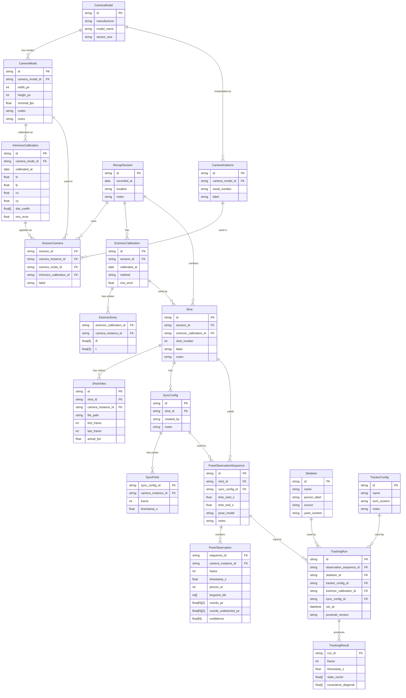
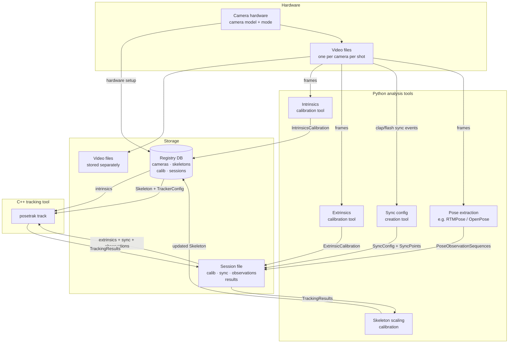

# Motion Capture Data Model and Storage Architecture

## 1. Entity–Relationship Model

The following diagram shows every first-class data entity and the relationships between them.
Cardinality notation: `||--o{` = one-to-many, `}o--o{` = many-to-many.



---

## 2. Key Design Decisions Embedded in the Model

### Camera modes decouple hardware from calibration
Intrinsics are tied to `CameraMode` (resolution + codec), not to `CameraInstance`.  The same
physical camera (instance) can run in different modes across sessions; each combination gets
its own intrinsics calibration without duplicating hardware metadata.

### Extrinsics live at the shot level, not the session level
A session usually shares one extrinsic calibration, but re-calibration mid-session (e.g.
after a camera is accidentally moved) can be captured by assigning a different
`ExtrinsicCalibration` to specific shots.

### Sync configs are per-shot, not per-sequence
A shot has exactly one sync config; multiple pose observation sequences share it.  This
matches reality: the sync alignment is done once per recording, then different time windows
or person crops are extracted from the same sync baseline.

### `PoseObservationSequence` is the atomic tracking input
A single run of `posetrak track` consumes exactly one sequence.  All relationships required
to reproduce a tracking run are reachable from `TrackingRun`:
- observations → sequence → shot → extrinsics → cameras (with intrinsics)
- sync config (from sequence or shot)
- skeleton
- tracker config

### Skeletons are global / cross-session
A skeleton file may be created from one session's calibration result and reused across many
sessions.  `Skeleton` therefore has no mandatory session FK.

---

## 3. Data Flow



---

## 4. Current Pain Points vs. Model Properties

| Problem now | How the model addresses it |
|---|---|
| "What calibration goes with this observation directory?" | `PoseObservationSequence → Shot → ExtrinsicCalibration` is a navigable FK chain |
| Sync file references pose directory frame numbers (fragile) | `SyncPoint` uses `camera_instance_id + frame`, independent of directory layout |
| Skeleton may or may not match camera session | `TrackingRun` explicitly records which skeleton was used |
| Reproducing a tracking run requires finding 5 separate files | `TrackingRun` records all 5 FKs; everything is findable from one row |
| Data scattered across arbitrary paths | Session file + registry keep all non-video data in ≤2 places |
| Disk heavy (per-frame JSON) | Binary/columnar storage of observations (see §5) |

---

## 5. Storage Technology Options

Two options are compared in detail below.  Both are language-independent and handle
arbitrary-length sessions efficiently.

---

### Option A — Single SQLite File per Session ⭐ recommended

One `.db` file per session contains everything: relational metadata in normal tables,
and bulk numeric arrays as **packed BLOBs** (one BLOB per frame per camera).

```
~/.posetrak/registry.db          ← cameras, modes, intrinsics, skeletons (tiny)
sessions/
  2026-02-15-gym.db              ← session: extrinsics, sync, observations, results
  2026-03-01-studio.db
skeletons/
  harri-full.yaml                ← YAML files referenced by path in registry.db
```

#### Schema sketch

```sql
-- Relational tables (normal rows)
CREATE TABLE shots (id TEXT PRIMARY KEY, extrinsic_id TEXT, label TEXT, ...);
CREATE TABLE sync_points (shot_id TEXT, camera_id TEXT, frame INT, timestamp REAL);
CREATE TABLE observation_sequences (id TEXT, shot_id TEXT, time_start REAL, ...);
CREATE TABLE tracking_runs (id TEXT, seq_id TEXT, skeleton_id TEXT, ran_at TEXT, ...);

-- Bulk array tables (BLOB rows — one row per frame × camera)
CREATE TABLE observations (
    seq_id   TEXT    NOT NULL,
    camera   TEXT    NOT NULL,
    frame    INTEGER NOT NULL,
    ts       REAL    NOT NULL,
    -- packed little-endian float32: K×3 values (kx, ky, confidence for each keypoint)
    kp_blob  BLOB    NOT NULL,
    PRIMARY KEY (seq_id, camera, frame)
);

CREATE TABLE tracking_results (
    run_id  TEXT    NOT NULL,
    frame   INTEGER NOT NULL,
    ts      REAL    NOT NULL,
    -- packed float64: state vector (D values)
    state   BLOB    NOT NULL,
    PRIMARY KEY (run_id, frame)
);
```

#### BLOB layout and encoding

The BLOB contains raw little-endian IEEE 754 binary (float32 for observations, float64
for tracking state).  Both Python and C++ interpret this identically with zero conversion:

**Python write (pose extractor):**
```python
import sqlite3, struct, numpy as np

kp = np.zeros((17, 3), dtype=np.float32)   # always explicit dtype — never infer
kp_blob = kp.tobytes()                      # 17 × 3 × 4 = 204 bytes

conn.execute(
    "INSERT INTO observations VALUES (?,?,?,?,?)",
    (seq_id, camera_id, frame, ts, kp_blob)
)
```

**C++ read (posetrak tracker):**
```cpp
// SQLiteCpp or raw sqlite3 C API
sqlite3_stmt* stmt;
sqlite3_prepare_v2(db,
    "SELECT frame, ts, kp_blob FROM observations "
    "WHERE seq_id=? AND camera=? ORDER BY frame", -1, &stmt, nullptr);

while (sqlite3_step(stmt) == SQLITE_ROW) {
    int frame = sqlite3_column_int(stmt, 0);
    double ts  = sqlite3_column_double(stmt, 1);
    auto* blob = static_cast<float const*>(sqlite3_column_blob(stmt, 2));
    int   nbytes = sqlite3_column_bytes(stmt, 2);
    Eigen::Map<Eigen::Matrix<float, Eigen::Dynamic, 3, Eigen::RowMajor> const>
        kp(blob, nbytes / (3 * sizeof(float)), 3);
    // kp(k, 0) = kx,  kp(k, 1) = ky,  kp(k, 2) = confidence
}
```

No type negotiation, no numpy interop layer, no HDF5 library — just bytes both sides agree on.

#### Performance at scale

Benchmark: 10-minute session at 30 fps, 5 cameras, 17 keypoints.

| Metric | Value |
|---|---|
| Observation rows | 5 cameras × 30 fps × 600 s = **90 000 rows** |
| BLOB size per row | 17 × 3 × 4 bytes = **204 bytes** |
| Observations total (uncompressed) | 90 000 × 204 bytes ≈ **18 MB** |
| Sequential read (one camera, full sequence) | one SQL scan, 18 000 rows → **< 50 ms** |
| Tracking result rows (one run) | 30 fps × 600 s = **18 000 rows** |
| State BLOB (e.g. 50-DOF skeleton) | 50 × 8 bytes = 400 bytes/row → **7 MB** |

The old concern about SQLite at scale assumed **row-per-keypoint** storage (77 M rows for
this session).  BLOB-per-frame-per-camera reduces that to 90 000 rows — well within SQLite's
sweet spot.

Page-level Zstandard compression (available in SQLite since 3.43 via `zstd_vfs`) can reduce
the observation data to 30–50% of the uncompressed size at negligible read overhead.  An
alternative is per-blob `zstd_compress` / `zstd_decompress` in the application layer (~5
lines each side).

**Pros:**
- Single file — trivially backed up, moved, or attached to the registry record
- Zero extra C libraries beyond SQLite (embedded everywhere, stdlib in Python)
- Full SQL queryability for all metadata and time-range selection
  (`WHERE ts BETWEEN 12.0 AND 15.0` works on the `ts` column)
- BLOB byte layout is under application control → explicit, self-documenting,
  no interop surprises
- Foreign key constraints enforce referential integrity
- WAL mode gives safe concurrent reads (e.g. GUI + tracker at same time)

**Cons:**
- BLOBs need documentation; not inspectable with a generic SQLite browser
- No built-in partial-array read (you always decode the whole BLOB for a frame, even
  if you only need one keypoint) — acceptable given BLOBs are small
- No chunked compression or native random slice access like HDF5 hyperslab

---

### Option B — SQLite Registry + HDF5 Session Files

```
~/.posetrak/registry.db          ← cameras, skeletons, session index (SQLite)
sessions/
  2026-02-15-gym/
    session.h5                   ← HDF5: extrinsics, sync, observations, results
```

HDF5 is a mature scientific format with excellent chunked compression (gzip, lz4, zstd),
partial-array reads via hyperslabs, and robust C library support.  The concern is
Python ↔ C++ interoperability.

#### HDF5 interoperability rules

The interop problems encountered in the Python prototype are real but fully avoidable.
They all come from one of three mistakes:

**Mistake 1 — numpy object dtype arrays.**  When h5py writes a Python list of strings, or a
ragged array, numpy infers `dtype=object`, which HDF5 stores as an opaque VLEN type.
C++ HighFive cannot read these.

```python
# WRONG — produces HDF5 VLEN type, unreadable from C++
f.create_dataset("names", data=["cam_a", "cam_b"])

# RIGHT — store strings as group attributes, not datasets
grp.attrs["camera_id"] = "cam_a"    # short scalars: fine as attributes
```

**Mistake 2 — letting numpy infer float dtype.**  `np.array([1.0, 2.0])` defaults to
`float64` on most platforms; `np.array([1, 2])` defaults to `int64`.  If the C++ code
expects `float32` the types won't match.

```python
# WRONG — dtype may differ between machines or numpy versions
f.create_dataset("keypoints", data=np.array(kp_list))

# RIGHT — always state dtype explicitly
f.create_dataset("keypoints", data=np.array(kp_list, dtype=np.float32),
                 compression="gzip", compression_opts=4)
```

**Mistake 3 — non-standard compression filters.**  h5py with Blosc or hdf5plugin's
non-builtin filters produces files that C++ cannot read unless it installs the same
filter plugin.

```python
# WRONG — requires blosc plugin on the C++ side
import hdf5plugin
f.create_dataset("state", data=arr, **hdf5plugin.Blosc())

# RIGHT — gzip is built into every HDF5 installation
f.create_dataset("state", data=arr, compression="gzip", compression_opts=4)
# or lz4 (via hdf5plugin) — only if C++ side also installs hdf5plugin
```

Following these three rules, every dataset written by h5py reads correctly from HighFive
and vice versa.

#### HDF5 layout (interop-safe)

```
session.h5
├─ /metadata               attributes only: session_id (str), date (str), version (int)
├─ /extrinsics/
│   └─ CAM_A/
│       ├─ R   float64[3,3]  ← matrix only, no string datasets
│       └─ t   float64[3]
├─ /shots/shot_001/observations/seq_001/CAM_A/
│   ├─ frame       int32[F]        ← plain numeric datasets throughout
│   ├─ timestamp   float64[F]
│   ├─ keypoints   float32[F,K,2]  ← gzip-compressed, chunk=(1,K,2)
│   └─ confidence  float32[F,K]
└─ /tracking/run_001/
    ├─ frame       int32[T]
    ├─ timestamp   float64[T]
    ├─ state       float64[T,D]    ← gzip level 4
    └─ cov_diag    float64[T,D]
```

**Pros:** Best compression ratio; partial reads (hyperslabs) avoid loading the full sequence;
`h5ls` / `h5dump` / HDFView for inspection; HighFive provides Eigen-native read/write.

**Cons:** Requires HDF5 C library (~3 MB); write corruption risk on interrupted flush (use
`H5F_ACC_SWMR_WRITE` for concurrent access); hierarchical layout is more complex to
implement than flat SQL tables; the interop rules above must be enforced by convention.

---

## 6. Recommendation

**Use Option A (SQLite with BLOB packing).**  The BLOB-per-frame-per-camera design
eliminates the row-count concern entirely (90 K rows vs 77 M for a 10-minute session) while
keeping full SQL queryability for metadata and time selection.  The byte layout is explicit
and under application control, so there is no type-negotiation interop layer to get wrong.
SQLite ships with Python's stdlib and is embeddable in C++ as a single amalgamation file —
zero extra dependencies on either side.

HDF5 (Option B) remains the better choice if you need:
- Hyperslab reads (read only frames 500–700 of one dataset efficiently)
- Very large sessions where chunked compression gives a significant size advantage
- Third-party tools (e.g. MATLAB, Julia DataFrames) that read HDF5 natively

The two can coexist: use SQLite as the primary session format, and add an HDF5 export
path for inter-tool exchange if a specific consumer requires it.

### Access pattern mapping

| Access pattern | How |
|---|---|
| "List all sessions using camera CAM-A in 2026" | SQL on `registry.db` |
| "Which intrinsics calibration was active for this run?" | SQL JOIN across registry tables |
| "Read cam3 observations, frames 500–700" | `SELECT … WHERE seq_id=? AND camera=? AND frame BETWEEN 500 AND 700` |
| "Export observations to pandas" | `pd.read_sql("SELECT …", conn)` + `np.frombuffer(row.kp_blob, dtype=np.float32).reshape(-1,3)` |
| "Reproduce run_001 exactly" | FK lookup in `tracking_runs` table |
| "Inspect file without code" | DB Browser for SQLite (GUI, free, cross-platform) |

### Migration path from current layout

1. Write a Python importer that reads the current per-frame JSON trees and inserts rows
   into `observations` (one BLOB per frame × camera).
2. Write a second importer that reads the current TOML camera calibrations and inserts
   them into `registry.db`.
3. Existing YAML skeletons stay as-is; `registry.db` holds the path and a content hash.
4. The `posetrak` CLI grows a `--session-db` flag alongside the existing directory-tree
   reader, for backward compatibility during transition.
