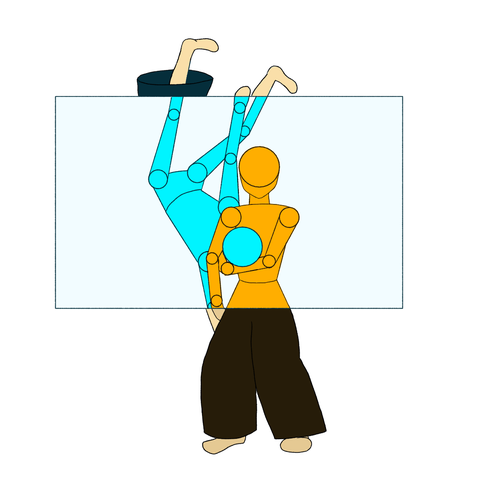

# Posetrak

{ align=right width=240 }

Video-based skeletal motion capture using an Unscented Kalman Filter in joint
space. Supports an arbitrary number of synchronized cameras and configurable
skeleton definitions, tracking results exported as BVH files.

Multi-person, close-contact scenes — the kind that break most affordable
motion capture — are the reason this project exists. See
[Background](background.md) for why.

## Applications

| Command | Description |
|---|---|
| `posetrak-ui` | Main GUI: sessions, capture setup, pose extraction, tracking, keypoint editing |
| `posetrak track config.toml` | Run the UKF tracker on a capture session |
| `posetrak scale config.toml` | Post-process a bone-length calibration run |
| `posetrak-mcp` | Read-only MCP diagnostic server for tracking runs |

`posetrak` also covers session/capture/detection management without the GUI
(`posetrak session`, `posetrak detect`, `posetrak track`, etc.) — see
[Architecture: Python apps](architecture/python-apps.md) for the full CLI.

## Getting started

See the [Setup guide](setup.md) for full platform-specific instructions, then
[Your first capture](user-guide/first-capture.md) for an end-to-end walkthrough.

## Documentation

- **[Setup](setup.md)** — prerequisites, build instructions, both platforms
- **[User Guide](user-guide/first-capture.md)** — capturing, calibrating, tracking, troubleshooting
- **[Architecture](architecture/overview.md)** — system design, data model, the UKF solver
- **[Reference](skeleton-format.md)** — file formats (skeleton YAML, state vector, sync metadata)
- **[Roadmap](roadmap.md)** — where the project is headed
- **[Background](background.md)** — why Posetrak exists

## License

Apache License 2.0. This project is [REUSE](https://reuse.software/) compliant.
