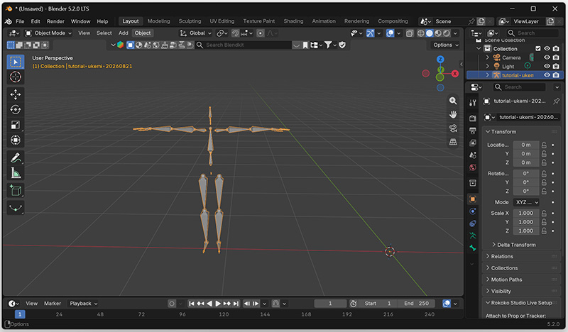
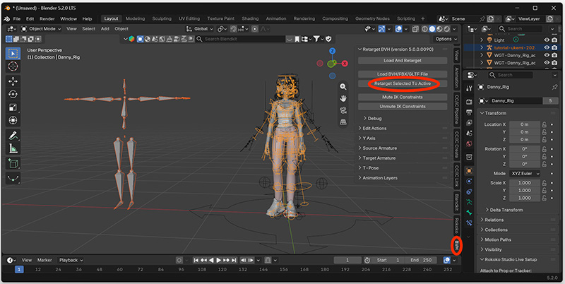
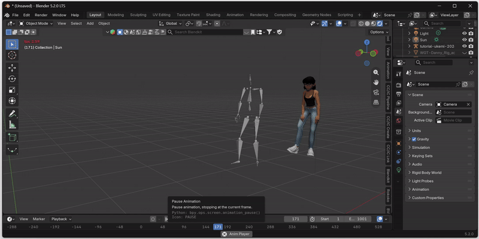

# Retargeting to Blender

Posetrak exports motion as [BVH](https://en.wikipedia.org/wiki/Biovision_Hierarchy),
a generic mocap interchange format built around Posetrak's own tracking
skeleton. Blender's built-in BVH importer will happily load that motion
onto an armature shaped exactly like Posetrak's skeleton — but that's
rarely the rig you actually want to animate. Getting the motion onto
your own character (different bone names, different proportions,
possibly a different bone count) is **retargeting**, and Blender has no
retargeting built in — it needs a dedicated add-on.

This page is a generic Posetrak → Blender retargeting workflow. It walks through
**BVH Retargeter**, a free, actively maintained add-on that handles arbitrary
source/target bone naming. If BVH Retargeter doesn't fit your pipeline there are
other options, for example (ordered from lightweight to more capable
but costly)

- Manual retargeting with **Copy Rotation** bone constraints — no
  add-on at all, just build the bone-to-bone mapping yourself. Viable
  for a one-off rig, painful to repeat.
- **Rokoko Studio Live for Blender** is built around Rokoko's own mocap format,
  but also accepts generic BVH. Retargeting functionality of the plugin is free
  but requires creating and logging in to a Rokoko account.
- **Auto-Rig Pro** (paid) — its Smart/Remap tools can retarget a BVH
  import onto an Auto-Rig Pro rig, with more automated bone-length
  matching than BVH Retargeter, at the cost of a purchase.
- Commercial animation software packages like
  [iClone](https://www.reallusion.com/iclone/default.html) or
  [Cascadeur](https://cascadeur.com/) have extensive tools for motion capture
  retargeting and cleanup. Both of the aforementioned tools work with Posetrak;
  stay tuned for dedicated tutorials for those.

The rest of this page covers **BVH Retargeter**, since it's free,
needs no account, and — with the one-time rig profile described below
— needs no manual bone mapping for Posetrak's skeleton.

## Prerequisites

- Blender 4.2 or later (BVH Retargeter's minimum supported version).
- A rigged target character in your `.blend` file. This tutorial uses "Danny", a
  free human model by Ethan Snell that has already been rigged with Blender's
  Rigify tool. You can load the model from the [artist's web
  site](https://pancake-manicure.gumroad.com/l/Danny).
- A BVH file exported from Posetrak.

## Installing BVH Retargeter

1. In Blender, open **Edit → Preferences → Get Extensions**, search for
   "BVH", and install **BVH and FBX Retargeter** (by Thomas Larsson).
2. Enable it if it isn't already (extensions installed this way are
   enabled by default).
3. A **BVH Retargeter** panel appears in the 3D viewport sidebar (`N`
   panel) whenever an armature is selected.

If your Blender build doesn't have the Extensions platform, or you want
to track a specific release, the same add-on is published at the
author's [project page](https://bitbucket.org/Diffeomorphic/retarget_bvh/wiki/Home/) —
install the zip via **Edit → Preferences → Add-ons → Install…**.

## Exporting BVH from Posetrak

In Posetrak, navigate to the trial's tracking results for the person. Click the
"Export BVH..." button in the information pane on the right side of the window.

## Importing into Blender

Use Blender's built-in importer: **File → Import → Motion Capture (.bvh)**.

- Leave **Forward**/**Up** axes at their defaults (`-Z Forward`, `Y Up`) — that
  already matches `--coord yup`.
- Select "Update scene FPS" and "Update scene duration" so that the scene's
  timeline works as expected.

This gives you a new armature shaped like Posetrak's tracking skeleton,
animated, with frame 1 holding the T-pose. Nothing here uses BVH
Retargeter yet.

## BVH Retargeter one-time setup: the Posetrak rig profile

There is no single "right" convention for representing a human skeleton; most 3D
packages and individual artists have different preferences. Unfortunately BVH
files include very little information about the convention used, which can
make retargeting an animation in another application painful. BVH Retargeter
tries to *guess* a source rig's bone roles and the joint angles that put the
model to T-pose, but for Posetrak's skeleton both guesses need some help:

- Posetrak's neck has two bones (`neck1`, `neck2`) before the head, but
  BVH Retargeter's automatic bone-role heuristic always assumes exactly
  one neck bone — it mislabels `neck2` as the head and leaves the real
  head bone unmapped, so head motion comes out visibly wrong.
- BVH Retargeter's automatic T-pose guess deliberately never touches
  clavicle/shoulder or foot/ankle bones — it only forces arms, legs, and
  fingers into shape, and leaves everything else at its raw imported
  rest orientation. Posetrak's BVH rest-pose bone directions for those
  two joints aren't anatomically correct on their own (the true T-pose
  only appears once frame 1's rotation is applied on top), so left
  alone, clavicles and feet come out of retargeting rotated roughly 90°
  off.

Both are fixed with two small JSON files that tell BVH Retargeter
exactly how to read Posetrak's rig, instead of guessing:

1. Get `known_rigs/posetrak.json` and `t_poses/posetrak.json` from
   [`examples/retargeting/blender/bvh-retargeter/`](https://github.com/hkaimio/posetrak/tree/main/examples/retargeting/blender/bvh-retargeter)
   in this repository.
2. Find your BVH Retargeter install folder:

     | OS | Path |
     |---|---|
     | Windows | `%APPDATA%\Blender Foundation\Blender\<version>\extensions\user_default\retarget_bvh\` |
     | macOS | `~/Library/Application Support/Blender/<version>/extensions/user_default/retarget_bvh/` |
     | Linux | `~/.config/blender/<version>/extensions/user_default/retarget_bvh/` |

3. Copy `known_rigs/posetrak.json` into that folder's `known_rigs/`
   subfolder, and `t_poses/posetrak.json` into `t_poses/`.
4. In Blender, run **BVH Retargeter → Init Known Rigs** (or just
   restart Blender) so it rescans both folders.

You only need to do this once per Blender install.

If you're tracking a custom skeleton with different joint names or a
different bone count, these two files won't match yours as-is — see
"Building your own rig profile," below.

## Retargeting

1. Have both armatures in the scene: your imported Posetrak BVH (the **source**)
   and your character rig (the **target**), already positioned/scaled sensibly
   relative to each other.
   - Open a new Blender scene & delete the default cube
   - Open the BVH file you previously expoterd from Posetrak in Blender (File ->
     import -> Motion Capture (.bvh)). You should see a human skeleton appear in
     the scene.
   - Select File -> Append... and locate the `Danny_Rig_1.0.blend` file you
     donwloaded previously. After opening it,navigate to "Collections", then
     "LINK_Dancer" to append the model to your scene.
2. Click the source armature (the one you imported from Posetrak BVH file) to
   select it, then **shift-click the target armature last** so both are selected
   and the target is active. The source should show as orange and the target as
   yellow.
3. Click **BVH Retargeter → Retarget Selected To Active**.
   
4. In the confirmation dialog:
     - **Source** — with the Posetrak rig profile installed, **Auto
       Source** should detect "Posetrak" automatically for both Source
       Rig and Source T-Pose; check that the dropdowns show that before
       confirming. If it didn't, uncheck **Auto Source** and
       set **Source Rig** to `Automatic` and **Source T-Pose** to
       `Posetrak` manually.
     - **Target** — if your target is a rig BVH Retargeter recognizes
       out of the box (Rigify, Mixamo-compatible, etc.), Auto Target
       should just work. If it's a custom rig and you see the same
       clavicle/foot rotation problem on the *target* after retargeting,
       it needs the same treatment — see below.
5. Confirm. Retargeting takes some time, depending on the length of your
   capture, and Blender will be unresponsive while BVH retargeter works. When
   ready, scrub the timeline to check the result.

Usually you need to do some adjustments to motion capture animations to get high
quality results. The tracking data might have errors, and the target model's
body dimensions are seldom exactly identical to those of the tracked person,
which can cause e.g. feet sliding on the ground and hands penetrating other
body parts. There are many tutorials on cleaning up motion capture data in
Blender — Google is your friend here.

!!! warning "Auto Source / Auto Target silently override your dropdown choices"
    Whichever of Auto Source / Auto Target is checked re-guesses the
    rig and T-pose from scratch every time you run an operator,
    overwriting whatever you'd manually selected — even if you picked
    the right T-pose moments earlier. If a manual T-pose selection ever
    seems to have "no effect," this is almost always why: check the
    checkbox, not just the dropdown.

## Building your own rig profile

If your target character rig (or a custom Posetrak skeleton YAML) isn't
recognized automatically and shows the same kind of misidentified or
misrotated joints, the fix is the same two-file pattern used above for
the source side:

1. **Fix the T-pose.** Pose the rig correctly — at frame 1 for a
   Posetrak BVH, or by hand for a target character rig — select it, and
   run **BVH Retargeter → Save T-Pose**, saving into that install's
   `t_poses/` folder. This captures every bone's current rotation
   exactly as posed.
2. **Fix bone identification**, only needed if the automatic
   name/hierarchy guess gets something wrong (e.g. an unusual chain
   length like Posetrak's two-bone neck): write a
   `known_rigs/<name>.json` with a `"bones"` map from the rig's real
   bone names to BVH Retargeter's canonical names (`hips`, `spine`,
   `chest`, `neck`, `neck-1` for a second neck segment, `head`,
   `shoulder.L`/`.R`, `upper_arm.L`/`.R`, …). Use
   `known_rigs/posetrak.json` in this repository as a worked example, or
   any of the simpler files bundled with the add-on itself (its
   `known_rigs/mixamo.json` is a good starting point).
3. Add `"t-pose-file": "<name>"` to the `known_rigs/<name>.json`
   (matching the `"name"` field in your saved T-pose file), so **Auto
   Source**/**Auto Target** picks up both automatically once it
   recognizes the rig.
4. **Init Known Rigs**, then retarget as above.

## Troubleshooting

**Shoulders and/or ankles rotated ~90° after retargeting**
: The Posetrak T-pose file isn't being applied. Check: the two JSON
  files are actually in the add-on's `known_rigs/`/`t_poses/` folders
  (not a subfolder, not renamed); **Init Known Rigs** was run after
  copying them; and — per the warning above — Auto Source is either
  correctly detecting "Posetrak," or is unchecked with "Posetrak" picked
  manually in both dropdowns.

**Head motion looks offset, or barely moves**
: Almost certainly the two-bone-neck issue described above. Confirm
  `known_rigs/posetrak.json` is installed and picked up — **List Source
  Rig** should show `neck1 → neck`, `neck2 → neck-1`, `head → head`.

**Retargeted motion just sits in the T-pose the whole time**
: Check that the frame range used by the retarget operator covers your
  actual motion, and that frame 1 (the T-pose reference the operator
  needs) is actually present — it isn't if you exported with
  `--no-rest-frame`.

## See also

- [Your first capture](first-capture.md) — where this fits in the
  overall workflow.

---

*Screenshots still needed: the BVH Retargeter sidebar panel, the
install-folder location in Preferences, the Retarget confirmation
dialog with Auto Source/Auto Target unchecked, and a before/after of
the shoulder & foot orientation fix.*
