# Tutorial 1 - Tracking motion with Posetrak

In this tutorial you will do a full motion capture from existing video files:
set up a Posetrak project, detect persons and poses from the videos, and finally
track a person's motion and export it as a BVH file that can be used in Blender
and other 3D applications.

Before starting, install the Posetrak application. See
the [setup guide](../setup.md) if you haven't done that yet. Then load the
[tutorial
materials](https://1drv.ms/u/c/5e84dad12af05ffc/IQAa_irEUQz6QoeMbzAWigbuAV8tjxp36djkLE02pJlKwFg?e=4n6WBb)
and unzip it to a directory in your computer. The zip file contains an (almost)
empty Posetrak project file and 3 videos that are shot with different types of
cameras at the same time, showing the captured motion from different angles.

## 1. Setting up the project

1. Open Posetrak application, choose File -> Open session... and open the
   tutorial1.db file
2. Select Session -> New capture...
3. In the dialog, name your capture "Tutorial 1" , click "Add videos..." and
   select all the 3 video files that you downloaded
3. For each video file, select the correct camera (video file names mention the
   camera used, and the tutorial project file has required configuration data
   for these) 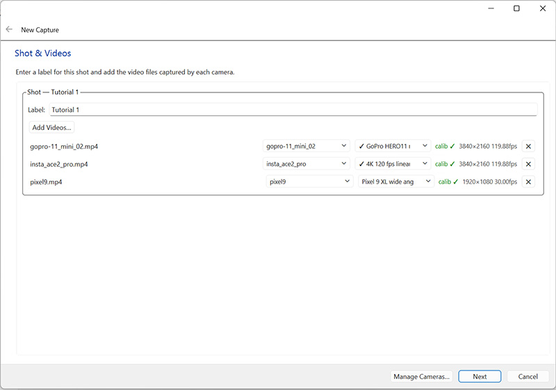

Click "Next" to move forward.

## 2. Synchronizing videos

Posetrak uses multiple camera views to reconstruct the exact pose of performers.
For this, the videos must be in sync: Posetrak needs to know which frames are
captured at the same time. It is usually enough that you show it the frames for
two moments, one near the start of the videos and one near their end. To help
with this, I have added a blinking LED on the floor: you can first search for
roughly the same moment in the videos, then look for the exact moments where the
LED lights up or turns off.

The "Camera Synchronization" window shows videos from 2 cameras side by side.
The left one is the **reference camera**, the right is the camera you are
synchronizing with the reference. I recommend using one camera as reference and
synchronizing all others to it, but this is not the only way: for example, you
can synchronize camera2 to camera1 and camera3 to camera2.

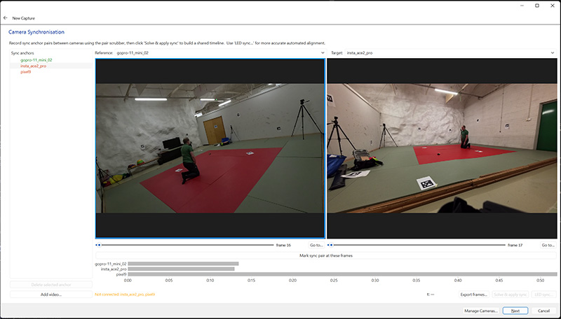

You can move the video playheads in several ways:

- Use the slider below the videos to quickly find the place you are looking for.

- For exact frame selection use keyboard shortcuts: in the reference video (the
  left one) `d` moves one frame forward and `a` one frame backwards. For the
  target video (right) the corresponding keys are `l` and `j`. Holding shift
  while pressing these keys moves the video 10 frames back/forward.

- You can also go to a specific frame by clicking the "Go to..." button on the
  right side of the slider.

Check that you have "gopro-11_mini_02" selected as reference and
"insta_ace2_pro" as target camera. Move the reference camera playhead using the
`a` and `d` keys to the first frame where the small LED on the floor goes off
(that is frame 16). Then find the same moment in the target camera using `j` and
`l` keys (it is frame 17). Verify that you have these frames in the two video
windows and click "Mark sync pair at these frames". You should see new entries
for the two cameras in the "Sync anchors" list on the left side of the window.

Next, change the target camera to "pixel9" and repeat the procedure - find the
first frame where pixel9 shows the LED off (it is also frame 17). Click "Mark
sync pair at these frames" again.

Now Posetrak knows a common "moment" at the start of the videos, but this is not
enough as the cameras might have slightly different frame rates. Therefore we
need to add another sync point at the end of the videos. Move the reference
camera playhead to roughly frame 1470 and use `a`/`d` to locate the frame where
the LED turns on (1477). Do the same for pixel9 in the right video panel (the
right frame is 1479). Click "Mark sync pairs..." again.

This time you will get a warning dialog that the frame rate ratio is
inconsistent. Pixel9's video declares a slower frame rate than it was actually
shot at (see [Synchronizing videos](synchronizing-videos.md#troubleshooting) for
why). Click the "pixel9 -> 119.962 fps" button to use the real capture rate;
you'll see the timeline adjust to match.

Finally, change the target camera to insta_ace2_pro, find the corresponding
frame where the LED turns on (frame 1477) and click "Mark sync pairs..." once
more. This time you do not get the frame rate warning message, as that video
file has the correct frame rate.

The left pane should now show 4 sync anchors for the reference camera and 2 for
the others. We are done with syncing the captured material. Click "Solve & apply
sync", then "Next".

## 3. Extrinsics calibration

Next, we need to tell it how they relate in space: where each camera was located
and how it was oriented. This is called extrinsics calibration. [Extrinsics
calibration guide](extrinsics-calibration.md) has more information about the
concepts and the automated methods available (markers, calibration rigs). This
tutorial skips those in favor of placing control points manually, so you learn
the UI they all build on.

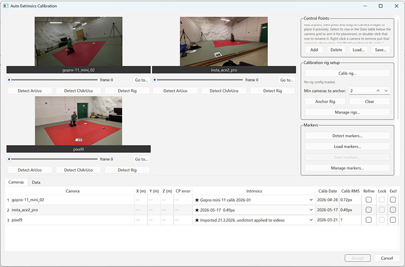

In the "Extrinsics calibration" page, click "Calibrate…".

Open the "Data" tab at the bottom of the dialog. This shows the points
already located - so far there are none.

We will place the origin of our coordinate system at the corner of the red
tatami area nearest to the blinking LED we used for synchronization. See the
iamges below for corrrect location of this and other control points.

In the qright side pane, locate "Control points" and click "Add...". Then click
that corner in all 3 camera images. When you press the mouse button on top of a
camera image, it zooms into the area around the mouse cursor. You can then move
the control point by dragging the mouse with the left button held down. When you
release the button, the control point is placed at that location. (You can also
redo this later if the point is in the wrong place.)

After placing the control point, enable the "Fix 3D position" checkbox in the
bottom right corner of the window. Check that the X, Y and Z coordinates are all
zero and click "Apply".

Our origin is now fixed, but we need more control points to set the axis
directions and scale. Add the following four the same way, fixing each one's 3D
position as given:

| # | Location | Coordinates | Notes |
|---|---|---|---|
| 2 | Corner of the red area near the benches and the green door | (4, 0, 0) | Red area is 4x4 m |
| 3 | Opposite corner from the origin | (4, 4, 0) | Not visible in `gopro-11_mini_01`; move the `insta_ace2_pro` playhead, since the performer is in front of it in the first frame |
| 4 | Last remaining corner of the red area | (0, 4, 0) | Not visible in `pixel9` |
| 5 | Corner of the red mats near the paper on the floor and control point 4 | (1, 3, 0) | A bit difficult to locate in `insta_ace2_pro` |

These images show correct locations of all 5 control points:

**GoPro-11_mini_02** (CP 3 is not visible to this camera)

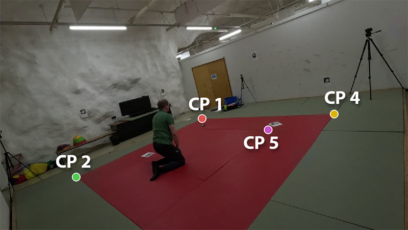

**Insta-ace2_pro**

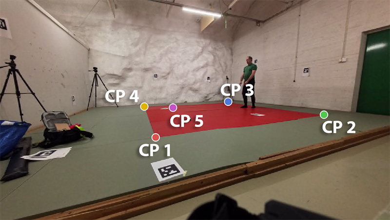

**Pixel 9** (control point 4 is not visible to this camera)

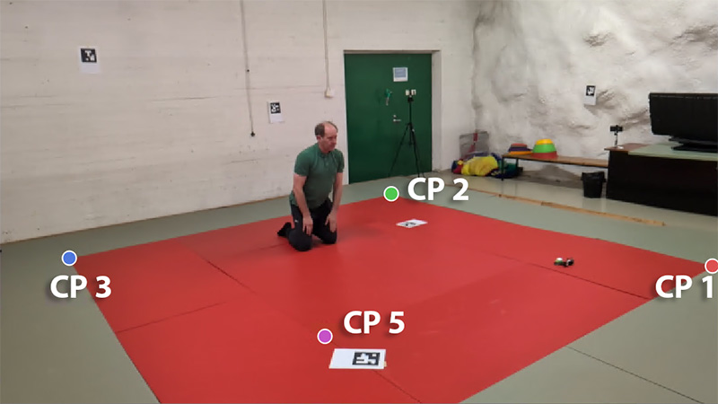

Now you can try solving extrinsics. Locate the "Solve" pane on the right side of
the window, disable "SIFT" for now and click "Match and solve". Open the
"Cameras" tab at the bottom of the window and check the solution quality. In my
case it looks quite good already: all cameras show ~5 pixel max error.

We can use automatic marker detection to add additional points to get a more
accurate solution. There are a few ArUco markers attached to the room's walls
and floor, and Posetrak can detect these automatically. From the sidebar's
"Markers" section, click "Detect markers...". In the dialog that opens, select
the correct marker dictionary, in this case DICT_5X5_50, and press OK. You
should see yellow dots at each marker corner. Click "Match and solve..." again
to use the newly detected markers as additional control points.

The extrinsics calibration is now done. Click "Accept".

## 4. Define persons in the capture

This is the last step of setting up the capture. Click "Add...", give the
tracked person a name (anything is fine). Select "Default male" as skeleton.

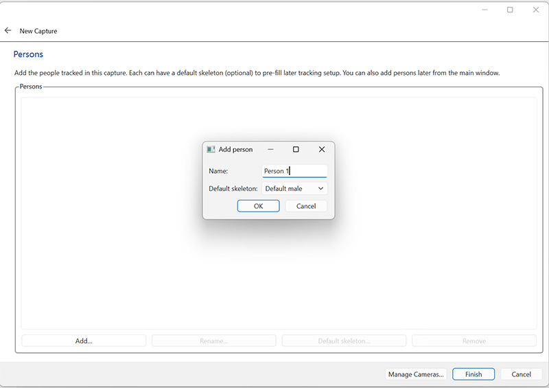

## 5. Define trial & detect motion from the videos

Now the capture material is ready and we can try to capture people's motions
from it. The time range of capture that Posetrak actually analyzes is called a
*trial*. Often you might leave the cameras on for a longer period and most of
that time nothing interesting happens (just turning on 6 or 8 cameras takes long
time).

Select your capture from the list in the navigation page (left side of the main
window). Use the time slider below the videos to select the start time for your
trial (in this case around 2s) and click "Mark Start". Move the time slider to
the end time of your trial (in this case around 12s) and click "Mark End".

Click "New trial..." and give your trial a name.

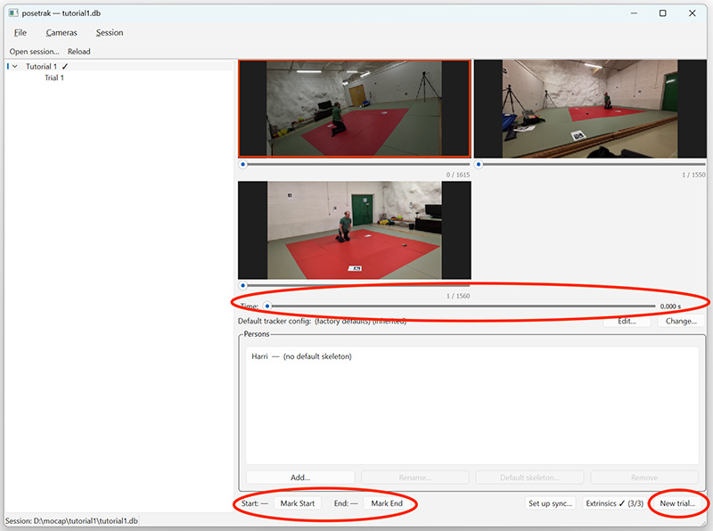

You should see the trial appear in the side pane under your capture. Select it.

Next, we need to detect the persons and their poses in the videos. Click "Run
detection...". Select "vitpose-l-133kp" as pose model, leave the other settings
at their default values, and click "Run Detection".

Running the detection takes some time. The first time, Posetrak loads the AI
models needed for this from the internet before starting. After it finishes, you
will see a detection under the trial (yes, you can run multiple detections for
the same trial, for example if you want to use different detection algorithms
for people, animals, etc.).

## 6. Match the detected motions to persons

Go to the detection page. You see a timeline of detected persons in each camera.
When you hover on top of it, you see the detected person and pose keypoints on
the right. Green dots are keypoints the detector is confident with; yellow and
red points are uncertain detections.

Before continuing we need to tell Posetrak who the person in each detections is.
In this capture there is only 1 person so this is easy, but yuo track multiple
persons (or others are just visible to some cameras) there will be more
detections. Right-click a row in the timeline and select the person in the
pictures. Do this for all 3 cameras. When you are ready, click "Save
assignments".

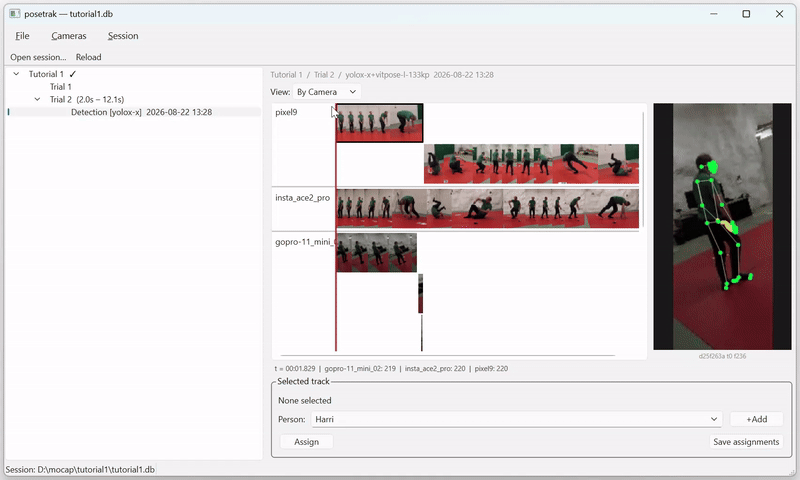

Some of the videos have multiple detection rows even though there is only 1
person present. This happens if the person tracking algorithm "loses" the
person, even for a brief moment. It plays safe, starts a new detection and lets
you decide if it is still the same person. See [analyzing
poses](analyzing-poses.md#direct-detection) for more details on this, and when a
separate segmentation stage is worth the extra setup (not for this simple,
single-person case).

After saving the assignments, you'll see a new entry for the person under the
detection in the navigation pane. Selecting that opens another page in the main
window.

## 7. Capturing 3D movement

Finally, we are ready for running the actual motion capture! In the person page
under detection, find the "Run tracker..." button and click it.

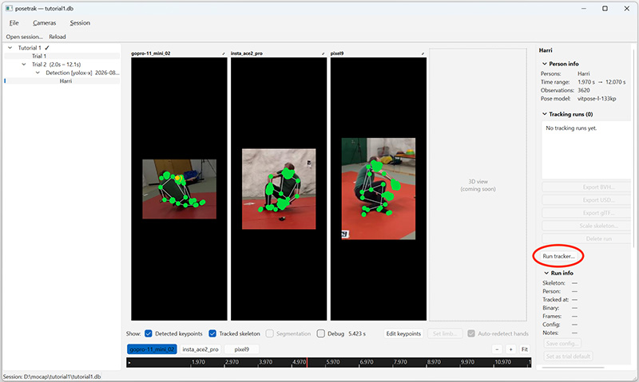

The tracker options dialog opens. The defaults are fine for this tutorial, so
just click "Run Tracker" again at the bottom of the dialog. You can follow the
tracker's progress; in my computer it takes bit less than 2 minutes.

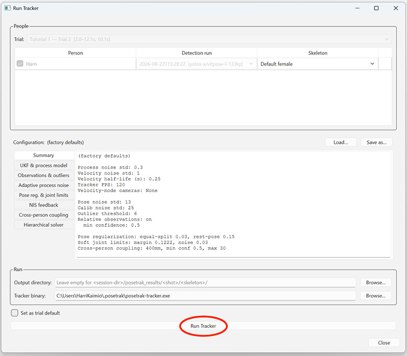

Congratulations - you are done! When the tracker finishes, there is a new entry
in the navigation pane under the person. That page looks almost the same as the
person page, but also shows the tracking results: you should see yellow dots on
top of the videos in addition to green dots. The yellow dots are the tracked 3D
joint positions as seen from that camera's point of view, while green dots are
the joint keypoints originally detected from the video. Ideally, they should be
at the same locations.

You can now export the captured motion as a BVH file by clicking the "Export
BVH..." button. Then open Blender, select File -> Import -> Motion Capture
(.bvh) and load the file in Blender.

This is where Posetrak's job ends — if you want to use the captured motion on a
real Blender character, continue to the [retargeting
tutorial](retargeting-blender.md).
